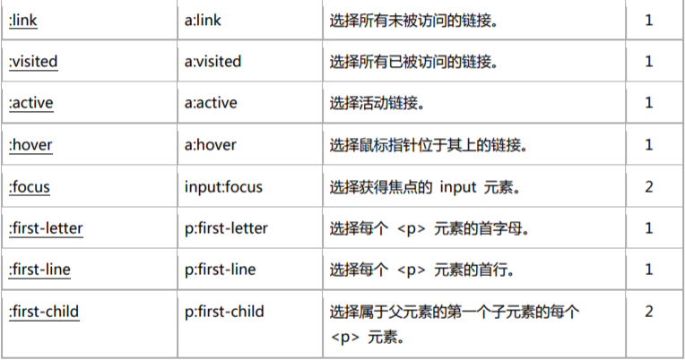
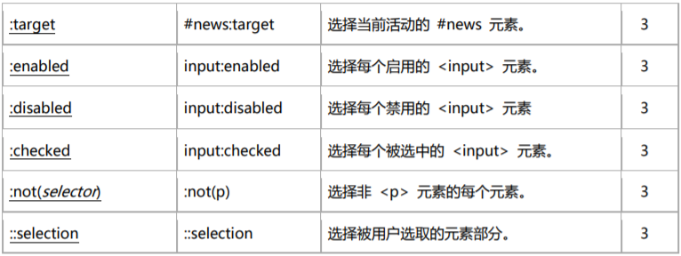
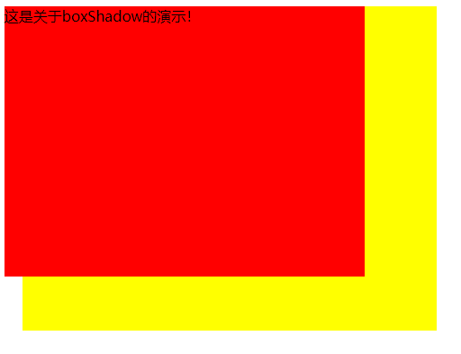
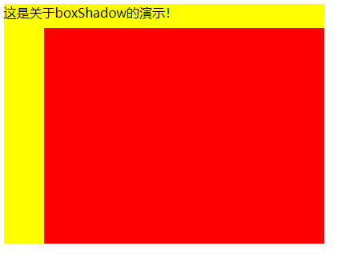

# CSS3


## 目录


1. [CSS3选择器](#1)

2. [CSS3边框与圆角](#2)

3. [CSS3背景与渐变](#3)

4. [CSS3转换](#4)

5. [CSS3过渡](#5)

6. [CSS3动画](#6)

7. [CSS3图片切换特效](#7)


***


<a name="1">


## CSS3选择器


选择器汇总表:








IE8基本支持所有CSS2选择器。

对于CSS3选择器，IE8只支持 `element1~element2` 和 `[attr^=val]`、`[attr$=val]`、`[attr*=val]`。


关于选择器在各浏览器的兼容性，可以查看:[Can I Use](https://caniuse.com/#search=selector)


注意:

- `[attribute~=value]`: 选择attribute属性值中包含value单词的元素。注意这里，必须value单独是一个属性值。而`[attr*=val]`只需要一个属性值中包含val即可。

- `[attribute|=value]`: 选择attribute属性值为value，或者以`value-`开头的元素。


***


<a name="2">


## CSS3边框与圆角


### CSS3圆角


`border-radius`属性: 一个最多可指定四个`border-*-radius`属性的复合属性，这个属性允许你为元素添加圆角边框。


语法: `border-radius: 1-4 length|% / 1-4 length|%`

**兼容IE9+。**


**指定每个圆角:**

`border-top-left-radius`: 定义左上角的弧度。
`boder-bottom-right-radius`: 定义右下角的弧度。

简写属性:

- 一个值: 四个圆角值相同。
- 两个值: 第一个值为左上角与右下角，第二个值为右上角与左下角。
- 三个值: 第一个值为左上角，第二个值为右上角和左下角，第三个值为右下角。
- 四个值: 依次为左上角、右上角、右下角、左下角。


***


### CSS3盒阴影


`box-shadow`: 可以设置一个或多个下拉阴影的框。

语法: `box-shadow: h-shadow v-shadow blur spread color inset;`

**兼容IE9+。**


示例:


水平阴影50px，垂直阴影30px，模糊、扩展都为0:
```
div {
	width: 400px;
	height: 300px;
	background: red;
	margin: 0 auto;
	box-shadow: 50px 30px 0 0 yellow;
}
```


水平阴影50px，垂直阴影30px，模糊为0，扩展为30px:
```
div {
	width: 400px;
	height: 300px;
	background: red;
	margin: 0 auto;
	box-shadow: 50px 30px 0 30px yellow;
}
```




水平阴影50px，垂直阴影30px，模糊、扩展为0，阴影内置:
```
div {
	width: 400px;
	height: 300px;
	background: red;
	margin: 0 auto;
	box-shadow: 50px 30px 0 0 yellow inset;
}
```




***


### CSS3边界图片

`border-image`: 用来构建美观的可扩展按钮。

语法: `border-image: source slice width outset repeat`


**不兼容IE！**


**border-image-source**: 指定要使用的图像，而不是由`border-style`属性设置的边框样式。

语法: `border-image-source: none|image;`


**border-image-slice**: 指定图像的边界向内偏移。

语法: `border-image-slice: number|%|fill;`


**border-image-width**: 指定图像边界的宽度。

语法: `border-image-width: number|%|auto;`


**border-image-outset**: 指定在边框外部绘制`border-image-area`的量。

语法: `border-image-outset: length|number;`


**border-image-repeat**: 用于图像边界是否应重复(repeated)、拉伸(stretched)、或铺满(rounded)。

语法: `border-image-repeat: stretch|repeat|round|initial|inherit;`


