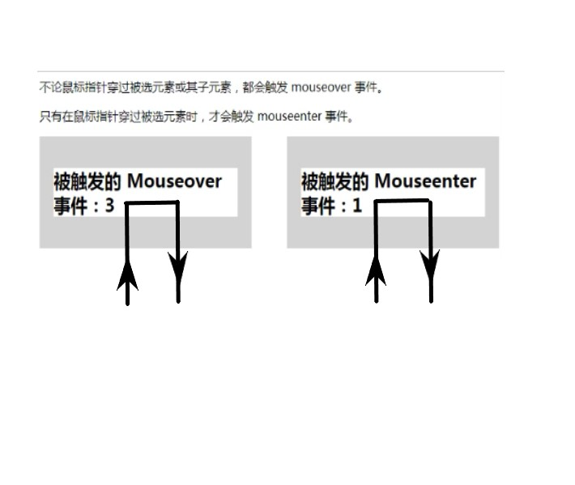
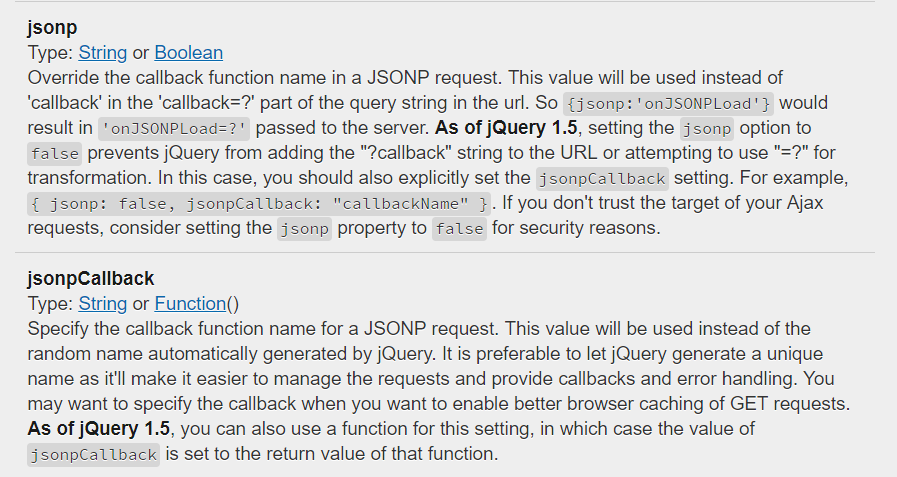

# jQuery


## 目录

1. [jQuery中的顶级对象](#1)
2. [jQuery对象和DOM对象](#2)
3. [jQuery中的选择器](#3)
4. [页面加载的事件](#4)
5. [jQuery操作CSS样式](#5)
6. [jQuery操作表单属性](#6)
7. [jQuery事件](#7)
8. [链式编程](#8)
9. [元素的获取、创建、添加、删除](#9)
10. [动画相关的方法](#10)
11. [Ajax](#11)

***
<br>


**JavaScript库**：把一些浏览器兼容性的代码或者是常用的函数封装在一个js文件中，这个文件就是一个JavaScript库，common.js 可以看成是一个js库

**jQuery**：一种专注于简化 DOM 操作，AJAX 调用和 Event 处理的 JavaScript 库, 能够解决大多数 JavaScript 在IE及各大浏览器上的兼容性问题

优点：体积小，功能强大，链式编程，隐式迭代，插件丰富

注意：jQuery 1.12以上的版本不再兼容IE8，如果需要兼容，使用低版本


<a name="1">

## jQuery中的顶级对象

- 浏览器中的顶级对象：window，浏览器和页面中所有的东西都是window的

- 页面中的顶级对象：document，页面中某些东西是document的

- jQuery中的顶级对象：jQuery，可以用`$`符号来代替，jQuery中的所有东西都是jQuery或者`$`符号下的

- 用法: `$.属性`，或者`$.方法`

- 大多数情况下，jQuery中都是方法，属性很少

- jQuery把DOM中的事件都封装成了一个方法。去掉了`on`，然后直接变成了方法, 往里面传入匿名函数，自动绑定this

- 如果希望jQuery对象能够调用自定义的方法，可以把这个方法加入到`$.fn`
	- `$.fn.sayHi = function(){};` 里面的this指向调用该方法的实例对象


```
// DOM中实现点击事件 
document.getElementById("id").onclick = function(){};

// jQuery中实现点击事件
$("#id").click(function(){});
```


- 可以将`$`的权限转移给别人，然后`$`会作为普通的变量使用
	- `var queen = $.noConflict();` // 将$的权利给了queen
	- `queen("#btn").click(function(){});`
	- 这可以作为多库共存的解决方案


### 几种常见对象

- 内部对象：js中自带的对象，Array，Object，Date，Math，RegExp
- 浏览器对象：window
- 自定义对象：自己定义的构造函数创建的对象
- DOM对象：通过DOM方式获取的对象
- jQuery对象：通过jQuery方式获取的对象


***
<br>

<a name="2">


## jQuery对象和DOM对象

### jQuery和DOM对象的互转

通过jQuery获取的对象和通过DOM获取的对象是**不相同**的

DOM对象转成jQuery对象:
```
var btnObj1 = document.getElementById("btn");
$(btnObj1).click(function(){});
```

jQuery对象转成DOM对象:
```
var btnObj2 = $("#btn");
btnObj2[0].onclick = function(){};
```

**为什么要互转？**

因为DOM操作很麻烦，往往为了兼容问题，一个功能写很多代码，转成jQuery对象后操作简单，不需考虑兼容问题。

jQuery操作中，又有一些兼容没有封装在jQuery中，可以转DOM对象，通过原生的js代码实现功能。


### jQuery对象访问

- `size()` 返回当前匹配的对象元素个数

- `length` 返回jQuery对象中元素的个数
	- 可以通过`$("#btn").length != 0` 来判断这个对象元素是否存在
	- 还可以通过这个来限制用户只创建一个对象

- `selector` 返回传给jQuery()的原始选择器，可以与context一起使用，用于精确检测选择器查询情况（对于插件开发人员很有用）

	- `$("div#foo ul:not([class])").selector` (返回`div#foo ul:not([class])`)
	
- `context` 返回传给jQuery()的原始的DOM节点内容，即jQuery()的第二个参数。如果没有指定，那么context指向当前的文档(document)

	- `$("ul", document.body).context.nodeName` (返回`body`)

- `get()` 获取jQuery匹配到的元素
	
	- 不传参数，则取得所有匹配的DOM元素集合
	- 传入index参数，取得index位置上的元素
	- `$(this).get(0)` 与 `$(this)[0]` 等价


- `index()` 搜索匹配的元素，并返回相应元素的索引值，从0开始计数，如果找不到匹配的元素，则返回-1

	1. 如果不给 `.index()` 方法传递参数，那么返回值就是这个jQuery对象集合中第一个元素相对于其同辈元素的位置
		- `$("li#flag").index();` 可以这样获取一个唯一元素在其父元素下的索引值

	2. 如果参数是一组DOM元素或者jQuery对象，那么返回值就是传递的元素相对于原先集合的位置
		- `$('li').index($('#bar'));` 获取#bar元素在所有li元素中的索引值
		- 注意：如果是一组元素对象，则返回这个对象中第一个元素在原先集合中的索引位置
		- `$('li').index($('li:gt(0)'));` (返回1)
	
	3. 如果参数是一个选择器，那么返回值就是**原先元素**相对于**选择器匹配元素**中的位置
		- `$('#bar').index('li');`  获取#bar元素在所有li元素中的索引值


- `each(callback)` 以每一个匹配的元素作为上下文来执行一个函数（迭代）

	- 会自动往回调函数里传入两个参数，第一个是索引，第二个是该元素(DOM对象)

```
$("#uu>li").each(function(index, ele){
	var opacity = (index+1)/10;
	$(ele).css("opacity", opacity);
});

```


***
<br>

<a name="3">


## jQuery中的选择器

DOM中获取元素的方式：
- 根据id获取元素
	- `document.getElementById("id属性的值");`
- 根据标签名字获取元素
	- `document.getElementsByTagName("标签名字");`
- 根据name属性获取元素
	- `document.getElementsByName("name属性的值");`
- 根据类样式名称获取属性
	- `document.getElementsByClassName("类样式的名字");`
- 根据选择器获取元素
	- `document.querySelector("选择器");`
	- `document.querySelectorAll("选择器");`

jQuery中获取元素的方式：
`$("选择器");`

### id选择器操作属性
```
$(function(){
    $("#btn").click(function(){
        this.value = "123"; // 通过dom操作实现
        $(this).val("123"); // 通过jQuery操作实现
    });
});
```

### 标签选择器操作属性
```
$(function(){
    $("#btn").click(function(){
        //根据标签选择器获取p标签
        $("p").text("我们都是p");
    });
});
```
`text()`方法相当于DOM中的`innerText`属性
- `对象.text()` 获取该元素的文本内容
- `对象.text("值")` 设置该元素的文本内容

**隐式迭代**

本身代码没有循环操作，jQuery内部帮助我们完成循环操作


### 类样式选择器操作属性

```
$(function(){
    $("#btn").click(function(){
    	//获取所有应用cls类样式的元素，改变背景颜色
        $(".cls").css("backgroundColor", "yellow");
        $(".cls").css("border", "1px solid red");
    });
});
```


### 属性选择器

可以先用`attr()`自定义属性方法设置属性，然后用该选择器获取指定元素

```
$(function(){
	$(".comment>li[index=1]").text("★");
});

```

### 交集选择器
```
$(function(){
    $("#btn").click(function(){
    	//先找p标签，从p标签中找应用了cls样式的元素
    	$("p.cls").css("border", "1px solid red");
    });
});
```

### 并集选择器
```
$(function(){
    $("#btn").click(function(){
    	//同时选中多个元素
        $("#dv,p,.cls").css("backgroundColor", "yellow");
    });
});
```

### 层次选择器

```
$(function(){
    $("#btn").click(function(){
    	//获取div元素中所有的span标签（直接的子元素，孙子元素）
        $("div span").css("backgroundColor", "red");
        //获取div这个父级元素中所有直接的子元素
        $("div>span").css("backgroundColor", "red");
        //获取的是div后面的所有兄弟元素(span)
        $("div~span").css("backgroundColor", "red");
        //获取的是div后面直接的兄弟元素(span)
        $("div+span").css("backgroundColor", "red");
    });
});
```


### 索引选择器

```
$(function(){
    $("#btn").click(function(){
        //odd 奇数
        $("#uu>li:even").css("backgroundColor", "red");
        //even 偶数
        $("#uu>li:odd").css("backgroundColor", "yellow");
    });
});
```

- `$("选择器:eq(索引值)")`来获取指定位置的子元素

- `$("选择器:lt(索引)")` 获取小于这个索引的元素

- `$("选择器:gt(索引)")` 获取大于这个索引的元素

- `$("选择器:last")` 最后一个

- `$("选择器:first")` 第一个


### 其他选择器

- `$("选择器:has(selector)")` 获取含有selector所匹配的元素的元素

- `$("选择器:hidden")` 获取所有不可见元素，或者type为hidden的元素

	- 例如: `display:none`、`<input type="hidden" name="id" />`


### 表单对象选择器


|    选择器           |      作用           |
| ------------- |:-------------:|
| :input      | 匹配所有input、textarea、select 和 button 表单元素 |
| :text      | 匹配所有单行文本框     |
| :password | 匹配所有密码框      |
| :radio | 匹配所有单选按钮 |
| :checkbox | 匹配所有复选框      |
| :submit | 匹配所有提交按钮 |
| :button | 匹配所有按钮     |

### 表单对象属性选择器

|    选择器           |      作用           |
| ------------- |:-------------:| 
| :enabled | 匹配所有可用元素 |
| :disabled | 匹配所有不可用元素 |
| :checked | 匹配所有选中的被选中元素(复选框、单选框等，不包括select中的option) |
| :selected | 匹配所有选中的option元素 |


***
<br>

<a name="4">


## 页面加载的事件

在DOM对象中，一个页面只能写一个`window.onload = function(){};`，多写的话，后面的会覆盖前面的。

而jQuery中可以依次触发多个页面加载事件。

- 第一种页面加载的事件(等待页面所有元素加载完毕后触发)
```
$(window).load(function(){
    console.log("hello");
});

$(window).load(function(){
    console.log("world");
});
```

- 第二种页面加载的事件(比load更快，页面中的基本元素加载后就触发)
```
$(document).ready(function(){
    console.log("hello");
});

$(document).ready(function(){
    console.log("world");
});
```

- 第三种页面加载的事件(也是页面中基本元素加载后就触发，和第二种类似，但更简便，用的较多)
```
$(function(){
    console.log("hello");
});

$(function(){
    console.log("world");
});
```

***
<br>

<a name="5">


## jQuery操作CSS样式


### 通过CSS类属性操作样式

```
$("#btn").click(function(){
    // 判断body标签是否应用了cls类的样式
    if($("body").hasClass("cls")){
        // 此处应用了cls类样式，就移除这个样式
        $("body").removeClass("cls");
    }else{
        // 此处没有应用类样式cls，那么添加类样式
        $("body").addClass("cls");
    }
});
```

### 通过css方法操作样式

```
$("#btn").click(function(){
    //判断这个按钮的值来修改body的样式
    //此处的this是当前的按钮DOM对象，需要转换为jQuery对象
    if($(this).val() == "关灯"){
        $("body").css("backgroundColor", "black");
        $(this).val("开灯");
    }else{
        $("body").css("backgroundColor", "");
        $(this).val("关灯");
    }
});
```

用`css()`方法设置宽高等属性时，若不加`px`，jQuery会自动帮我们加上，不过为了保持和DOM中的习惯一致，建议都加`px`


### jQuery用css()操作样式的三种方式


```
$(function () {

    $("#btn").click(function () {
        //设置div的样式

       // 第一种写法
        $("#dv").css('width', "300px");
        $("#dv").css('height', "300px");
        $("#dv").css('backgroundColor', "red");

        // 第二种写法(链式)
        $("#dv").css("width", "300px").css("height", "300px").css("backgroundColor", "red")

        // 第三种写法
        var json = {"width": "200px", "height": "100px", "backgroundColor": "red"}
        $("#dv").css(json);
    });
});
```


### 直接获取指定CSS样式值的方法


**获取设置宽高**

`$("#dv").css("width");` 这样获取的宽实际是一个带`px`的字符串，后续计算还需要`parseInt`来提取数字

- 可以使用方法`$("#dv").width();` 这样直接获取了元素的宽

- 可以传入数值，修改元素的宽，可以不加`px`

- `height()` 同理


**inner宽高和outer宽高**

`innerHeight()`、`innerWidth()`

- 返回元素的高度和宽度(包括内边距)

`outerHeight()`、`outerWidth()`

- 返回元素的高度和宽度(包括内边距和边框)

`outerHeight(true)`、`outerWidth(true)`

- 返回元素的高度和宽度(包括内边距、边框和外边距)


**获取设置left和top**

`offset()`

- 获取匹配元素在当前视口的相对偏移。

- 返回的对象包含两个整型属性：top 和 left, 此方法只对可见元素有效。

- 设置元素的`offset`时，需要传入一个对象参数，`$("#dv").offset({"left":500, "top":250 });`

注意:

- 这里得到的top是包含了`top`和`margin-top`**两个值的和**，left同理


**获取滚动条属性值**

- `scrollTop()`
- `scrollLeft()`

- 获取匹配元素相对滚动条顶部和左侧的偏移，此方法对可见和隐藏元素均有效。
- 可以直接传入数值，设置偏移量

`$("div.demo").scrollLeft(300);`


#### 固定导航栏实现

```
$(window).scroll(function(){

	if($(this).scrollTop() > $(".top").height()){
		// 设置导航栏固定定位
		$(".nav").css("position", "fixed");
		// 设置偏移量为0
		$(".nav").css("top", 0);
		// 让下面的主体栏能够平滑过渡，不因为导航栏脱标而迅速上移
		$(.main).css("marginTop", $(".nav").height());
	}else{
		$(".nav").css("position", "static");
		$(".main").css("marginTop", 0);
	
	}
	
});
```


***
<br>

<a name="6">


## jQuery操作表单属性

### 标签属性操作

DOM操作中设置和获取value属性的值--> `对象.value`

jQuery中: 

- `jQuery对象.val();` 表示获取该元素的value属性值

- `jQuery对象.val("值")` 表示设置该元素的value属性值

- `jQuery对象.css("css的属性名字", "属性的值");` 设置元素的样式属性值

- `jQuery对象.html()` 相当于innerHTML

- `jQuery对象.text()` 相当于innerText


### 表单属性操作

**文本域**

- `$("#te").text();` 可以用来设置`textarea`文本域中的内容，不要用`val()`

**下拉框**

- `.val();` 一般常用来设置表单属性的值，但是也有一些例外，并不是设置的意思

比如: 为下拉框`select`标签中`value`属性是`5`的这个`option`标签设置选中:

`$("select").val(5)` 并没有设置其`value`值，只是选中而已

**单选、复选框**

- 操作选择按钮(`type = "radio/checkbox"`)的属性: 
	
	- DOM中操作: `document.getElementById("r").checked = true;`
	
	- jQuery转换为DOM操作: `$("#r").get(0).checked = true;`


**自定义属性方法attr**

- jQuery中可以使用自定义属性方法: 
	- `$("#r").attr("checked", "true");`（不建议用attr操作checked等状态属性）
	- 如果标签默认选中了，`attr("checked")` --> `checked`
	- 如果标签没有选中，`attr("checked")` --> `undefined`
	- 注意：
	- `attr`方法针对单选框或者复选框的是否选中问题，切换起来很麻烦，几乎不用！

- 当然自定义属性，还可以设置一些本不存在的属性，比如说`attr("hello", true);`用来帮助标记

- 当属性没有被设置时候，`.attr()`方法将返回`undefined`, 而不是`false`

- 若要检索和更改DOM属性,比如元素的checked, selected, 或 disabled状态，请使用`prop()`方法。

- `removeAttr("属性");`移除这个自定义属性


**prop()方法**

- 用来获取或设置元素是否选中的状态，推荐使用`prop()`方法

- `prop("属性");` 获取这个元素是否选中，返回true或false

- `prop("属性", "值");` 值一般是布尔类型


- 可以将第二个参数设置为一个function，该函数返回新的属性值

点击一个按钮切换选中状态:
```
$("input[type='checkbox']").prop("checked", function( i, val ) {
  return !val;
});

```

设置tbody中所有复选框的选中状态和当前点击的复选框(全选/全不选 按钮)的选中状态一致: 
```
$("#all").click(function(){
	$("#tb").find("input").prop("checked", $(this).prop("checked"));
	
});

```

设置当所有复选框都被选中时全选框自动选中，否则不选中:
```
$("#tb").find("input").click(function(){
	var allLength = $("#tb").find("input").length;
	var ckLength = $("#tb").find(":checked").length;
	
	$("#all").prop("checked", allLength == ckLength );
});
```


***
<br>

<a name="7">


## jQuery事件


### mouseenter和mouseleave

```
$(function(){
    // 获取ul中所有的li，然后设置鼠标进入和鼠标离开事件
    $(".wrap>ul>li").mouseenter(function(){
        $(this).children("ul").stop().show(200);
    });
    
    //鼠标离开
	$(".wrap>ul>li").mouseleave(function(){
        $(this).children("ul").stop().hide(200);
	});
});
```

- `mouseenter`和`mouseleave`用来替代DOM事件中的`mouseover`和`mouseout`

- `show()`相当于DOM中的`display: block;`，`hide()`相当于DOM中的`display: none;`

- `show()`和`hide()`可以传入参数，单位为毫秒，代表动画效果展现的速度

- `stop()`方法停止所有在指定元素上正在运行的动画。如果队列中有等待执行的动画(并且clearQueue没有设为true)，他们将被马上执行


```
$(function(){
    $("#left>li").mouseenter(function(){
        // 获取当前li的索引值
        var index = $(this).index();
        
        //隐藏所有的li
        $("#center>li").hide();
        
        //显示当前对应的li
        $(#center>li:eq(" + index + ")").show();
    });
});
```

- `index()`方法用来获取当前对象的索引值

- `li:eq()`索引选择器，接受index参数作为索引，获取指定元素


当然还有很多其他事件，比如`click`、`focus`、`scroll`、`keydown`，在此不一一介绍


**mouseenter和mouseover的区别**


- `mouseenter`与 `mouseover` 事件不同，只有在鼠标指针穿过被选元素时，才会触发 `mouseenter` 事件。
- 如果鼠标指针穿过任何子元素，同样会触发 `mouseover` 事件



`mouseleave`和`mouseout`也同理

我们没必要为容易触发太多次的操作绑定事件，所以在jQuery中我们一般都是用`mouseenter`和`mouseleave`


### 用bind为元素绑定事件

**绑定事件的方式:**

- 第一种:

```
$("#btn").mouseenter(function(){}).mouseleave(function(){});
```


- 第二种:

```
$("#btn").bind("click", function(){}).bind("mouseenter", function(){});
```

- 第三种:

```
$("#btn").bind({"click":function(){}, "mouseenter", function(){}});
```


### 给元素绑定事件的注意点

- 在DOM中，给同一个元素绑定多个相同的事件，后面的会覆盖前面的，为此我们用了`addEventListener()`和`attchEvent()`来解决这个问题

- 而在jQuery中，即使连续绑定相同事件，也不会出现覆盖的情况，而会依次触发

- 在jQuery中使用`bind()`方法绑定相同事件的时候，若按照上面第二种方式绑定，也会依次触发

- 但是需要注意，当按照第三种方式，即**键值对**的方式来绑定多个相同事件，则只会执行最后一个!


### 用delegate绑定事件

在`bind()`方法内部，实际调用的是另一个方法`on`绑定的事件

还有一个方法:`delegate()`, 内部也是调用了`on`

`$("#dv").delegate("p", "click", function(){});`

- 该方法为p元素绑定了click事件

- 父级元素调用该方法，为子级元素绑定事件

- 子级元素委托父级元素绑定事件

**使用这个方法来给子级元素绑定事件，即使在绑定后又新增了子元素，新的子元素也会有该事件**


### on方法

前面提到了，`bind`和`delegate`内部都是调用`on`方法来实现的

`on(events,[selector],[data],fn)` : 在选择元素上绑定一个或多个事件的事件处理函数

- `events`:一个或多个用空格分隔的事件类型和可选的命名空间，如"click"或"keydown.myPlugin" 。

- `selector`:一个选择器字符串用于过滤器的触发事件的选择器元素的后代。如果选择 null或省略，当它到达选定的元素，事件总是触发。

- `data`:当一个事件被触发时要传递`event.data`给事件处理函数。

- `fn`:该事件被触发时执行的函数。 false 值也可以做一个函数的简写，返回false。

**所以，其实`on`方法在有`selector`参数时，就是`delegate`的用法，没有`selector`参数时，就是`bind`的用法**

需要注意`on`方法参数的位置！先是`event`参数，再是`selector`，和`delegate`参数的位置**相反**


### 几种方式绑定事件的区别

- `对象.事件名字(事件处理函数)` -->普通的写法
- `对象.bind(事件的名字，事件处理函数)`

上面两种方式，可以为存在的元素绑定事件，后添加的元素**没有事件**

下面的两种，采用**委托**的方式，可以为存在的元素绑定事件，后添加的元素**也有事件**

- `对象.delegate("选择器", " 事件名字", 事件处理函数)`
- `对象.on("事件名字", "选择器", 事件处理函数)`


建议以后绑定事件都用`on`的方式

注意: 在jQuery中也会有事件冒泡，子元素被点，也会触发祖先元素的点击事件


### 解绑事件

用什么方式绑定事件，最好就用对应的方式解绑事件


#### unbind解绑

`unbind()`

- 传入事件名字作为参数，可以将这个元素绑定该事件的所有方法都解绑

- 如果不传入参数，此时该元素的所有的事件全部解绑

- 可以传入多个事件的字符串，事件之间用空格隔开，实现同时解绑多个事件

```
$("#btn").click(function(){
	// 解绑#dv的所有点击事件
	$("#dv").unbind("click");
	// 该元素的所有事件全部解绑
	$("#dv").unbind();
	// 同时解绑多个事件
	$("#dv").unbind("mouseenter mouseleave");
});

```


#### undelegate解绑

`undelegate([selector,[type],fn])`

```
$("#btn2").click(function(){
	// 解绑#dv里面的元素的所有事件
	$("#dv").undelegate();
	// 解绑#dv里面的p元素点击事件
	$("#dv").undelegate("p", "click");
	// 解绑#dv里面p元素的多个事件
	$("#dv").undelegate("p", "mouseenter mouseleave");
});

```


#### off解绑事件

和`on`对应，`off`解绑自然也是功能最全的

**注意和其他解绑方式对比记忆:**

```
$("#btn3").click(function(){
	// 父级元素和子级元素的所有的事件全部解绑
	$("#dv").off();
	// 父级元素和子级元素的点击事件全部解绑
	$("#dv").off("click");
	// 解绑父级元素和子级元素的多个事件，空格隔开
	$("#dv").off("click mouseenter");
	// 解绑p标签的点击事件
	$("#dv").off("click", "p");
	// 解绑p标签的多个事件
	$("#dv").off("click mouseenter", "p");
	// 解绑p的所有事件
	$("#dv").off("", "p");
	// 解绑#dv中所有子元素的点击事件
	$("#dv").off("click", "**");
	
});

```


### 事件冒泡

在DOM中，取消事件冒泡，用`window.event.cancelBubble=true;`和`event.stopPropagation();`

而在jQuery中取消事件冒泡，只要在事件绑定函数的最后`return false`就行了，内部自动解决了兼容问题, 同时也会取消默认行为


### 事件的触发

```
$("#btn").click(function(){
	// 事件触发第一种方式，通过别的元素来触发
	$("#txt").focus(function(){});
	
	// 事件触发第二种方式，通过 trigger 触发
	$("#txt").trigger("focus");
	
	// 事件触发第三种方式，通过 triggerHandler 触发
	// 注意该方式不会触发浏览器的默认行为, 如文本框内出现光标
	$("#txt").triggerHandler("focus");
	
});

```


### 事件参数对象

在jQuery中，给元素绑定事件的时候，都会传入一个事件对象参数，不管是IE还是别的浏览器

该事件对象中包含了很多属性，如`button`，`clientX`，`currentTarget`, `delegateTarget`, `target`等等

```
$(document).mousedown(function(e){
	// 获取鼠标按键的值，左键是0，滚轮是1，右键是2
	console.log(e.button);
	
	if(e.ctrlKey){
		console.log("用户同时也按下了ctrl键");
	}else if(e.shiftKey){
		console.log("用户同时也按下了shift键");
	}else if(e.altKey){
		console.log("用户同时也按下了alt键");
	}else{
		console.log("用户按下了鼠标");
	}
	
});

```


- `e.target` 这个属性得到触发该事件的目标对象，此时是一个DOM对象
	- 可以通过 `$(e.target).attr("id")` 将其转换为jQuery对象来获取里面的属性
	
- `e.currentTarget` 这个属性得到的是触发该事件的当前的对象

- `e.delegateTarget` 这个属性得到的是代理的这个对象

- `screenX`、`screenY`、`pageX`、`pageY`...鼠标相对于屏幕、页面的坐标
 


***
<br>

<a name="8">

## 链式编程

### 原理

链式编程：对象连续地调用方法

- 语法: `对象.方法().方法().方法();`

- 对象调用方法，如果返回值还是当前这个对象，那么就可以继续调用这个方法

```
$("#btn").click(function () {
    // 这些方法获取属性值，返回的是属性值，不能链式编程
    console.log($(this).val());
    $("p").text();

    // 这些方法是设置属性值，返回的还是当前对象，此时就可以链式编程
    console.log($(this).val("hello"));
    $("p").text("hi");


    // 通过链式编程设置类样式
    $("#dv").addClass("cls").addClass("cls2");
    // 下面这种写法和上面效果一样
    $("#dv").addClass("cls cls2");


    // addClass()方法，在括号里设置内容，或者什么都不设置，返回的也都是这个对象
    // removeClass()方法，同上
	// toggleClass()方法，同上

    // 设置元素的样式可以使用css()方法，也可以使用addClass()或者是removeClass()方法
    // 但是css方法不能添加或者移除类样式

});

```


### 通过构造函数实现链式调用

```
function Person(age){
	this.age = age;
	this.sayHi = function(txt){
		// 可以判断，当用户传入参数，返回对象
		if(txt){
			console.log("hello" + txt);
			return this; // 如果这里不返回原对象，默认会返回undefined，就不能链式调用了
		}else{
			console.log("hello")
		}
	};
	this.eat = function(){
		console.log("eat some food");
		return this;
	};
}

var per = new Person(10);

per.sayHi("Tom").eat().sayHi();


```


***
<br>

<a name="9">

## 元素的获取、创建、添加、删除

### 兄弟元素、父子元素的获取

```

//获取某个li的下一个兄弟元素
$(this).next("li").css("backgroundColor", "yellowgreen");

// 获取某个li的前一个兄弟元素
$(this).prev("li").css("backgroundColor", "greenyellow");

// 获取某个li后面的所有兄弟元素
$(this).nextAll("li").css("backgroundColor", "red");

// 获取某个li前面的所有兄弟元素
$(this).prevAll("li").css("backgroundColor", "red");

// 获取当前的li的所有兄弟元素（不包括自己）
$(this).siblings("li").css("backgroundColor", "grey");

```


- **断链**：对象调用方法后，返回的已经不是当前的这个对象了，此时再继续调用方法，出现了断链，无法继续链式调用
- 用 end() 方法可以修复断链，恢复断链之前的状态，但是会影响性能，不推荐使用

```
$(this).prevAll("li").css("backgroundColor", "yellow").end().nextAll("li").css("backgroundColor", "blue");
```


#### 案例: tab栏产品切换的实现

```
    // 设置当前鼠标进入的li添加类样式，同时移除当前li的所有兄弟元素的类样式
    $(this).addClass("active").siblings("li").removeClass("active");

    // 获取当前鼠标进入的li的索引值
    var index = $(this).index();
    
    // 获取下面的所有产品div，将选中的添加样式，其余的删除样式
    $(".products>div:eq("+index+")").addClass("selected").siblings("div").removeClass("selected");
```


- `当前元素.parent()` --> 父级元素

- `当前元素.children()` --> 当前元素的所有的子元素(直属的子元素)

- `当前元素.find("选择器")` --> 是找出正在处理的元素的后代元素的好方法

从所有的段落开始，进一步搜索下面的span元素: `$("p").find("span")`, 与`$("p span")`相同


#### 案例:五角星评分效果实现

```
$(".comment>li").mouseenter(function(){
	// 当前鼠标碰触的li是实心的五角星，前面的li也是实心，后面的li是空心
	$(this).text("★").prevAll("li").text("★").end().nextAll("li").text("☆");
	
}).click(function(){
	// 当鼠标点击哪个li，就给它设置一个自定义的标记属性，同时删除其它li中该标记
	$(this).attr("flag", "1").siblings("li").removeAttr("flag");
	
}).mouseleave(function(){
	// 鼠标移开，先清除所有实心，如果用户之前没有点击，这时就结束了
	$(".comment>li").text("☆");
	// 判断，获取带有flag标记的li，然后将其前面的设置为实心，后面的设置为空心
	$(".comment>li[flag=1]").text("★").prevAll("li").text("★");
	
});


```


### 元素的创建和添加


#### 创建节点

- **方式一:**

`$('<span>这是一个span元素</span>').appendTo($("#dv"))`

先创建一个jQuery对象，然后添加到父级元素中，类似DOM中的`createElement()`

- **方式二:**

`$("#dv").html("<span>这是一个span元素</span>")`

直接给元素的内部html赋值，会覆盖原有的内容，相当于DOM中的`innerHTML`


#### 添加节点

**在被选元素内部的结尾插入内容**

- 父级元素.append(子级元素)
`$("#dv").append($("<a href='http://www.baidu.com'>百度</a>"));`

- 子级元素.appendTo(父级元素)
`$("<a href='http://www.baidu.com'>百度</a>").appendTo($("#dv"));`


**在被选元素内部的开头插入内容**

- `pretend` 

- `pretendTo`

用法和`append`、`appendTo`一样


**在指定兄弟元素的前后插入内容**

- `$("#dv").before($("<span>this is a span</span>"))`

此时`span`是`div`的前一个兄弟元素

- `$("#dv").after($("<span>this is a span</span>"))`

此时`span`是`div`的后一个兄弟元素


**实例:**

- 给ul中添加li，同时实现hover动画效果

```
$("<li>first</li><li>second</li><li>third</li><li>fourth</li>").appendTo(ulObj).mouseenter(function () {
    $(this).css("backgroundColor", "green");
}).mouseleave(function () {
    $(this).css("backgroundColor", "");
}).click(function () {
    $(this).css("color", "pink").css("fontFamily", "宋体").css("fontSize", "50px");
});
```


- 第二种方式，动态添加li，并实现动画效果

```
var arr = ["first", "second", "third", "fourth"];
var ulObj = $("<ul></ul>");
$(function () {
    for(var i=0;i<arr.length;i++){
        $("<li>"+arry[i]+"</li>").appendTo(ulObj).mouseenter(function () {
            $(this).css("backgroundColor", "green");
        }).mouseleave(function () {
            $(this).css("backgroundColor", "");
        });
    }
});
    
```

**注意:**
- 获取已有的元素，并通过append方法添加到另外一个元素中的时候，类似于剪切
- 若想实现复制效果，需要使用clone方法: `$("#dv1>p").clone().appendTo($("#dv2"));`


### 元素的删除

- 清空元素中所有子级元素

`$("#dv").html("")`

`$("#dv").empty()`

- 自杀方法

`$("#dv").remove()`

比如: `$("#dv").children("ul").remove()`


***
<br>

<a name="10">


## 动画相关的方法

- **show()**
	- 显示隐藏的匹配元素
	- 如果选择的元素是可见的，这个方法将不会改变任何东西
	- 无论这个元素是通过`hide()`方法隐藏的还是在CSS里设置了`display:none;`，这个方法都将有效


- **hide()**
	- 隐藏显示的元素
	- 如果选择的元素是隐藏的，这个方法将不会改变任何东西


- **slideDown()** 
	- 通过高度变化（向下增大）来动态地显示所有匹配的元素，在显示完成后可选地触发一个回调函数
	- 上下的padding和margin也会有动画，效果更流畅


- **slideUp()**
	- 通过高度变化（向上减小）来动态地隐藏所有匹配的元素，在隐藏完成后可选地触发一个回调函数


- **slideToggle()**
	- 通过高度变化来切换所有匹配元素的可见性，并在切换完成后可选地触发一个回调函数

- **fadeIn()**
	- 通过不透明度的变化来实现所有匹配元素的淡入效果，并在动画完成后可选地触发一个回调函数
	- 这个动画只调整元素的不透明度，也就是说所有匹配的元素的高度和宽度不会发生变化
	
- **fadeOut()**
	- 通过不透明度的变化来实现所有匹配元素的淡出效果，并在动画完成后可选地触发一个回调函数。


- **fadeToggle()**
	- 通过不透明度的变化来开关所有匹配元素的淡入和淡出效果

以上方法，第一个参数是毫秒数，第二个参数是回调函数

- **fadeTo()** 

	- 把所有匹配元素的不透明度以渐进方式调整到指定的不透明度，并在动画完成后可选地触发一个回调函数
	
	- 第一个参数是毫秒数，第二个参数是指定的不透明度


- 同时，这些方法第一个参数也可以传字符串参数: 

	- fast:200ms
	
	- normal:400ms
	
	- slow:600ms


- **stop()**

	- 在同一个元素上执行多个动画，那么对于这个动画来说，后面的动画会被放到动画队列中，等到前面的动画执行完成了才会执行
	
	- `stop`方法，停止动画效果
	
	- 第一个参数，是否清除队列
	
	- 第二个参数，是否跳转到最终结果
	
	- 如果没有传入参数，这些动画将被马上执行


### 用递归实现连续动画

```
$("btn01").click(function () {
    // 从第一个开始逐渐显示
    $("div>img:first").show(300, function f1() {
        $(this).next().show(300, f1);
    });
});

$("btn02").click(function () {
    // 从最后一个开始逐渐隐藏
    $("div>image:last").hide(300, function f1() {
        $(this).prev().hide(300, f1);
    });
});
```


### 自定义动画方法

**animate()**
- 用于创建自定义动画的函数

- 参数1: 键值对--css属性值组合
	- 每个属性的值表示这个样式属性到多少时动画结束
	- 如果是一个数值，样式属性就会从当前的值渐变到指定的值
	- 如果使用的是“hide”、“show”或“toggle”这样的字符串值，则会为该属性调用默认的动画形式
	- 可以使用 `em` 和 `%` 单位

- 参数2: 时间--毫秒

在一个动画中同时应用三种类型的效果:

```
$("#go").click(function(){
  $("#block").animate({ 
    width: "90%",
    height: "100%", 
    fontSize: "10em", 
    borderWidth: 10
  }, 1000 );
});
```

用500毫秒将段落移到left为50的地方并且完全清晰显示出来（透明度为1）:

```
$("p").animate({
   left: 50, opacity: 'show'
 }, 500);
```


一个使用“easein”函数提供不同动画样式的例子。只有使用了插件来提供这个“easein”函数，这个参数才起作用:

```
$("p").animate({
   opacity: 'show'
 }, "slow", "easein");
``` 


***
<br>


<a name="11">


## Ajax


使用原生js实现Ajax异步操作非常麻烦，详情请看：[原生JS实现Ajax异步请求](http://www.cnblogs.com/longyincug/p/8849045.html)

而jQuery封装好了底层的细节，调用ajax请求非常简单。


### get/post( url [, data ] [, success ] [, dataType ])

如下，异步请求一个Server.php页面，将id为namevalue的值传递过去，并接受返回数据data，设置成id为result的文本框的值。

```
$.get('Server.php', {name:$('#namevalue').val()},function(data,textStatus,jqXHR){
    $("#result").text(data);
});
```

post请求也同理，只需要把get改成post即可。


对于错误的处理:

```
$.get('Server.php', {name:$('#namevalue').val()},function(data){
    $("#result").text("请求数据中，请稍后...");//当网络堵塞时，可以改善用户体验
    $("#result").text(data);
}).error(function(){
    console.log("通讯错误");
});
```


### `load(url,[data,[callback]])`

载入远程 HTML 文件代码并插入至 DOM 中，默认使用GET方式，传递附加参数时自动转换为POST方式。

使用示例:

```
$('body').load('box.html', function(responseText, status, jqXHR){
    console.log(status); // success或者error
    if(status=='error'){
        $('body').text('加载失败')
    }
});
```


### `getScript(url,[callback])`

通过 HTTP GET 请求载入并执行一个 JavaScript 文件。

```
$.getScript('test.js',function(){alert("Script loaded and executed.");});
```

可以用来载入一些插件，然后调用回调函数，调用其内的方法。

```
$.getScript('hello.js', function(data, textStatus, jqXHR){
  console.log( data ); // Data returned
  console.log( textStatus ); // Success
  console.log( jqXHR.status ); // 200
  console.log( "Load was performed." );
});
```


### `getJSON(url,[data],[callback])`

通过 HTTP GET 请求载入 JSON 数据。

可以通过使用JSONP形式的回调函数来加载其他网域的JSON数据，如 "myurl?callback=?"。jQuery 将自动替换 ? 为正确的函数名，以执行回调函数。

**注意：此行以后的代码将在这个回调函数执行前执行。**

使用示例:

```
//从 Flickr JSONP API 载入 4 张最新的关于猫的图片。

//HTML代码
<div id="images"></div>

//jQuery代码
$.getJSON("http://api.flickr.com/services/feeds/photos_public.gne?tags=cat&tagmode=any&format=json&jsoncallback=?", function(data){
    $.each(data.items, function(i, item){
        $('').attr('src', item.media.m).appendTo($('#images'));
        if(i==3) return false;
    });
});
```


关于`$.ajax()`中JSONP选项的使用:



如:

```
$.ajax({
    url:"http://localhost:7788/MyService.php?callback=?",   
    dataType:"jsonp",
    jsonpCallback:"callbackName",
    success:function(data){
        alert(data.name + " is a a" + data.sex);
    }
});
```

**关于`jsonp`的安全性防范:**

1、防止`callback`参数意外截断js代码，特殊字符单引号双引号，换行符均存在风险（对一些特殊字符如尖括号进行编码处理）

2、防止`callback`参数恶意添加标签（如`script`），造成`XSS`漏洞（`response header`添加设置`Content-Type`为`text/javascript`，避免浏览器按照HTML方式解析）

3、防止跨域请求滥用，阻止非法站点恶意调用（通过`referer`白名单匹配，以及 `cookieToken` 机制来限制）


