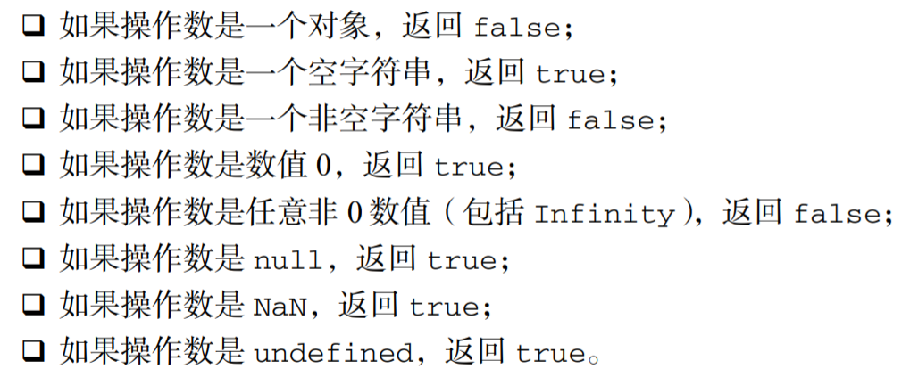
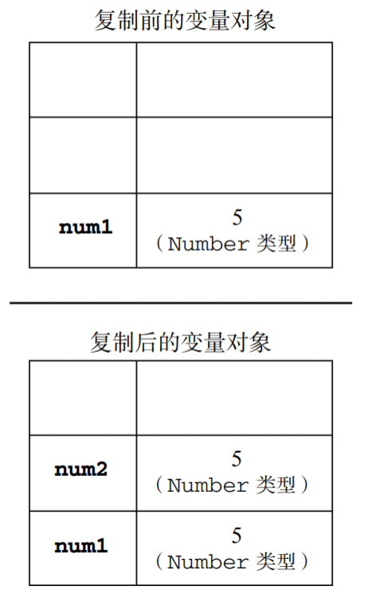
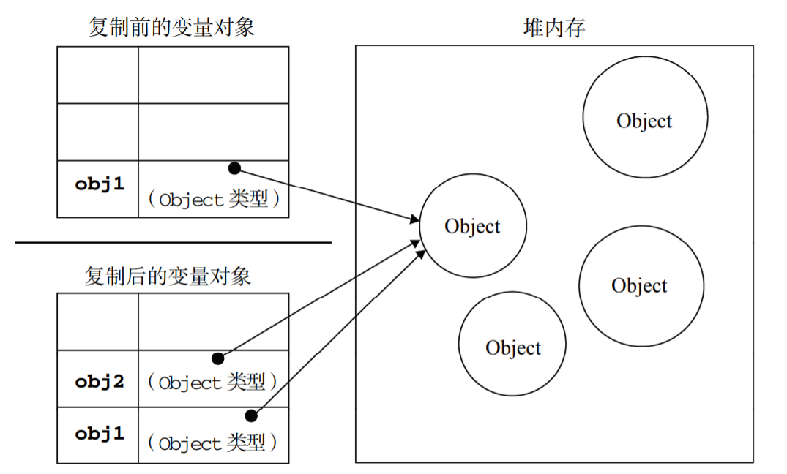

# JavaScript高级程序设计


## 简介

> 这是在学习《JavaScript高级程序设计》过程中记下的笔记，方便自己查漏补缺，温故知新。
>
> 本文中内容基本摘录自原书。

## 目录

1. [第一章 JavaScript简介](#1)

2. [第二章 在HTML中使用JavaScript](#2)

	- [script元素](#2a)

	- [嵌入脚本与外部脚本](#2b)

	- [文档模式对JavaScript的影响](#2c)

	- [小结](#2d)

3. [第三章 基本概念](#3)

	- [语法](#3a)

	- [数据类型](#3b)

	- [操作符](#3c)

	- [语句](#3d)

	- [函数](#3e)

	- [小结](#3f)

4. [第四章 变量、作用域和内存问题](#4)

	- [基本类型和引用类型](#4a)
	
	- [执行环境及作用域](#4b)
	
	- [垃圾收集](#4c)

	- [小结](#4d)

5. [第五章 引用类型](#5)

	- [Object类型](#5a)
	
	- [Array类型](#5b)
	
	- [Date类型](#5c)
	
	- [RegExp类型](#5d)
	
	- [Function类型](#5e)
	
	- [基本包装类型](#5f)
	
	- [单体内置对象](#5g)
	
	- [小结](#5h)


***

<a name="1">

## 第一章 JavaScript简介

### JavaScript实现

1. 一个完整的JavaScript实现应该由以下三个不同部分组成:

	- 核心（ECMAScript）:提供核心语言功能
	- 文档对象模型（DOM）:提供访问和操作网页内容的方法和接口
	- 浏览器对象模型（BOM）:提供与浏览器交互的方法和接口

2. ECMAScript第5版于2009年发布，新功能包括:

	- 原生JSON对象（用于解析和序列化JSON数据）
	- 继承的方法和高级属性定义
	- 严格模式，对ECMAScript引擎解释和执行代码进行了补充说明

3. ECMAScript受主流Web浏览器支持情况:

	


4. **文档对象模型（DOM）**

	- 是针对XML但经过扩展用于HTML的应用程序编程接口（API）
	- 把整个页面映射为一个多层节点结构
	- 借助DOM提供的API，开发人员可以轻松的删除、添加、替换、修改任何节点

	- 由于Netscape和IE对DHTML各持己见，负责制定Web通信标准的W3C着手规划DOM
		1. DOM1级
			- 由两个模块组成:DOM核心和DOM HTML
			- DOM核心规定的是如何映射基于XML的文档结构，简化对文档中任意部分的操作
			- DOM HTML模块则是在DOM核心的基础上加以扩展，添加了针对HTML的对象和方法

		2. DOM2级
			- 如果说DOM1级的目标主要是映射文档的结构，那么DOM2级的目标就宽泛多了
			- DOM2 级在原来 DOM 的基础上又扩充了（DHTML 一直都支持的）鼠标和用户界面事件、范围、遍历（迭代 DOM文档的方法）等细分模块，而且通过对象接口增加了对 CSS的支持。
			- 引入了DOM视图、DOM事件、DOM样式、DOM遍历和范围 等新模块

		3. DOM3级
			- 进一步扩展了DOM，引入了以统一方式加载和保存文档的方法（DOM加载和保存模块）
			- 新增验证文档的方法（DOM验证模块）


	- Web浏览器对DOM的支持
		- 目前支持DOM已经成为浏览器开发商的首要目标，Mozilla开发团队的目标更是构建与标准100%兼容的浏览器
		- 主流浏览器对DOM标准的支持情况:
		- 


5. **浏览器对象模型（BOM）**

	- 开发人员可以使用BOM控制浏览器显示的页面以外的部分
	- BOM真正与众不同的地方（也是经常会导致问题的地方），是它作为JavaScript实现的一部分却没有相关的标准
	- 在HTML5中，这个问题得到了解决，HTML5致力于把BOM功能写入正式规范
	
	- BOM的一些部分：
		- 弹出新浏览器窗口的功能
		- 移动、缩放和关闭浏览器窗口的功能
		- 提供浏览器所加载页面的详细信息的location对象
		- 提供浏览器详细信息的navigator对象
		- 提供用户显示器分辨率详细信息的screen对象
		- 对cookies的支持
		- 像XMLHttpRequest和IE的ActiveXObject这样的自定义对象


***

<a name="2">


## 第二章 在HTML中使用JavaScript

<a name="2a">

### `<script>`元素

1. **`<script>`元素**
	- HTML 4.01 为其定义了6个属性:
		1. `async`, 可选，表示应立即下载脚本，但不应妨碍页面中其他操作，只对外部脚本文件有效
		2. `charset`, 可选，表示通过src属性指定的代码的字符集，由于大多数浏览器会忽略它的值，故很少用
		3. `defer`, 可选，表示脚本可以延迟到文档完全被解析和显示之后再执行，只对外部脚本文件有效
		4. `language`, 可选，原来用于表示编写代码使用的脚本语言，大多数浏览器会忽略这个属性，因此没有必要再用
		5. `src`, 可选，表示包含要执行代码的外部文件
		6. `type`, 可选， 可以看成是language的替代属性，表示编写代码使用的脚本语言的内容类型（也称为MIME类型）
			- 虽然`text/javascript`已经不被推荐使用，但人们一直以来使用的都还是它
			- 实际上，服务器在传送JavaScript文件时使用的MIME类型通常是`application/x-javascript`，但在type中设置这个值却可能导致脚本被忽略
			- 另外，在非IE浏览器中还可以使用`application/javascript`和`application/ecmascript`
			- 考虑到约定俗成和兼容，目前type的属性值依旧还是`text/javascript`，如果没有指定这个属性，其默认值仍是`text/javascript`

	- 使用`<script>`元素的方式有两种:
	
		- 直接在页面中嵌入。包含在其中的JavaScript代码将被从上而下依次解释，在浏览器对`<script>`元素内部的所有代码求值完毕之前，页面中的其余内容都不会被浏览器加载或显示
		
		- 包含外部JavaScript文件，那么src属性就是必须的了，这个属性的值是一个指向外部JavaScript文件的链接
	
	- 需要注意，带有src属性的`<script>`元素不应该在其内再包含额外的JavaScript代码，如果包含了嵌入的代码，则只会下载并执行外部脚本文件，嵌入的代码会被忽略

	- 通过src属性，还可以包含来自外部域的JS文件，这一点上，和img非常相似，即它的src属性可以是指向当前HTML页面所在域之外的某个域中的完整URL

	- 无论如何包含代码，只要不存在`defer`和`async`属性，浏览器都会按照script元素在页面中出现的先后顺序对其依次进行解析

2. **标签的位置**

	- 按照传统的做法，所有的script元素都应该放在页面的head元素中，这种做法的目的是把所有外部文件（包括CSS文件和JavaScript文件）的引用都放在相同的地方
	
	- 这意味着必须等到所有的js代码都被下载、解析和执行完成后，才能开始呈现页面的内容（浏览器在遇到body标签才开始呈现内容），这会导致浏览器呈现页面出现明显的延迟
	
	- 为了避免延迟的问题，现在Web应用程序一般都把全部JavaScript引用放在`body`元素中页面内容的后面

3. **延迟脚本**

	- script标签defer属性的用途是表明脚本在执行时，不会影响页面的构造，也就是说，脚本会被延迟到整个页面都解析完毕后再运行
	- 因此，在`<script>`元素中设置defer属性，相当于告诉浏览器立即下载，但延迟执行
	- `<script type="text/javascript" defer="defer" src="example1.js"></script>`
	- 该延迟脚本会等浏览器遇到</html>标签后再执行，但会先于 `DOMContentLoaded` 事件执行（详见第13章）
	- 现实中，多个延迟脚本不一定会按照顺序执行，也不一定会在`DOMContentLoaded`事件触发前执行，因此最好只包含一个延迟脚本
	
4. **异步脚本**

	- async属性告诉浏览器立即下载文件，但与defer不同的是，标记为async的脚本并不保证按照指定它们的先后顺序执行，因此确保多个async脚本之间互不依赖非常重要
	- 指定async属性的目的是不让页面等待脚本下载和执行，从而异步加载页面其他内容，为此，建议异步脚本不要在加载期间修改DOM
	- `<script type="text/javascript" async src="example1.js"></script>`
	- 异步脚本一定会在页面的`load`事件前执行，但可能会在`DOMContentLoaded`事件触发之前或之后执行
	- 在XHTML文档中，要把async属性设置为`async="async"`(defer同理)


<a name='2b'>

### 嵌入脚本与外部脚本

1. 在HTML中嵌入 JavaScript 代码虽然没有问题，但一般认为最好的做法还是尽可能使用外部文件来包含 JavaScript 代码

2. 使用外部脚本有以下优点:
	- 可维护性: 不触及HTML标记的情况下集中精力编辑js代码
	- 可缓存: 加快页面加载的速度
	- 适应未来: 通过外部文件来包含js无须使用XHTML或注释hack。HTML和XHTML包含外部文件的语法是相同的


<a name="2c">

### 文档模式对JavaScript的影响

1. 文档模式，通过文档类型（doctype）切换实现

2. 最初的两种文档模式是**混杂模式**和**标准模式**

3. 如果在文档开始处没有发现文档类型声明，则所有浏览器都会默认开启混杂模式，不同浏览器在这种模式下的行为差异非常大，如果不使用某些hack技术，跨浏览器的行为根本没有一致性可言

4. 虽然这两种模式主要影响CSS内容的呈现，但在某些情况下也会影响到JavaScript执行的情况


<a name="2d">


### 小结

把 JavaScript 插入到 HTML 页面中要使用`<script>`元素。使用这个元素可以把 JavaScript 嵌入到 HTML 页面中，让脚本与标记混合在一起；也可以包含外部的 JavaScript 文件。而我们需要注意的地方有：

- 在包含外部 JavaScript 文件时，必须将 src 属性设置为指向相应文件的 URL。而这个文件既可以是与包含它的页面位于同一个服务器上的文件，也可以是其他任何域中的文件。

- 所有`<script>`元素都会按照它们在页面中出现的先后顺序依次被解析。在不使用 `defer` 和 `async` 属性的情况下，只有在解析完前面`<script>`元素中的代码之后，才会开始解析后面`<script>`元素中的代码。

- 由于浏览器会先解析完不使用 `defer` 属性的`<script>`元素中的代码，然后再解析后面的内容，所以一般应该把`<script>`元素放在页面最后，即主要内容后面，`</body>`标签前面。

- 使用 `defer` 属性可以让脚本在文档完全呈现之后再执行。延迟脚本总是按照指定它们的顺序执行。

- 使用 `async` 属性可以表示当前脚本不必等待其他脚本，也不必阻塞文档呈现。不能保证异步脚本按照它们在页面中出现的顺序执行。


***


<a name="3">

## 第三章 基本概念

<a name="3a">

### 语法

1. 区分大小写: ECMAScript中的一切（变量、函数名、操作符）都区分大小写

2. 标识符: 指变量、函数、属性的名字，或者函数的参数
	- 第一个字符必须是一个字母、下划线、或者一个美元符号
	- 其他字母可以是字母、下划线、美元符号或数字
	- 按照惯例，标识符采用驼峰大小写格式
	- 不能把关键字、保留字、true、false和null用作标识符

3. 严格模式: ES5引入，是为JS定义的一种不同的解析和执行模型
	- 在严格模式下ES3的一些不确定的行为将得到处理，对于不安全的操作会报错
	- 在函数内部上方添加 `use strict`或在页面顶部添加，可以指定在严格模式下执行
	- 严格模式下，JS的执行结果会有很大不同，接下来会随时指出严格模式下的区别
	- 支持严格模式的浏览器包括: IE 10+、Firefox 4+、Safari 5.1+ 和 Chrome

4. 语句
	- ES中的语句以一个分号结尾，如果省略分号，则由解析器确定语句的结尾，建议任何时候都不要省略它

5. 关键字和保留字

	- 关键字可用于表示控制语句的开始或结束，或者执行特定操作等:
	- 
	
	- 保留字在语言中还没有特定用途，但将来可能用作关键字:
	- 
	
	- 此外ES5新增保留字 `let`,`yield` 

6. 变量

	- ES的变量是松散类型的，可以用来保存任何类型的数据
	- 定义变量时要使用var: `var message;`该变量可以用来保存任何值
	- 未经过初始化的变量，会保存一个特殊的值——`undefined`，支持在声明的同时初始化变量
	- 用`var`操作符定义的变量将成为定义该变量的作用域中的局部变量，也就是说，如果在一个函数中使用var声明一个变量，那么这个变量会在函数退出后销毁

	```
	function test(){
		var message = "hi"; // 局部变量
	}
	test();
	alert(message); // 错误！
	```

	- 虽然省略 var 操作符可以定义全局变量，但这也不是我们推荐的做法。
	- 因为在局部作用域中定义的全局变量很难维护，而且如果有意地忽略了 var 操作符，也会由于相应变量不会马上就有定义而导致不必要的混乱。
	- 给未经声明的变量赋值在严格模式下会导致抛出 `ReferenceError` 错误。

	- 可以使用一条语句定义多个变量，只要用逗号分开即可
	
	```
	var message = "hi",
		found = false,
		age = 29;
	```


<a name="3b">

### 数据类型

1. ES中有5种简单数据类型(`Undefined`、`Null`、`Boolean`、`Number`、`String`)还有一种复杂数据类型——`Object`，`Object`本质上是由一组无序的名值对组成

2. ES中不支持任何创建自定义类型的机制，所有值最终都将是上述6种数据类型之一

3. `typeof`操作符: 鉴于ES的松散类型，因此需要有一种手段来检测变量的数据类型

	- `undefined`——如果这个值未定义
	- `boolean`——如果这个值是布尔值
	- `string`——如果这个值是字符串
	- `number`——如果这个值是数值
	- `object`——如果这个值是对象或null
	- `function`——如果这个值是函数

#### `null` 和 `undefined`

- 实际上，`undefined` 值是派生自 `null` 值的，因此在进行相等性测试时返回`true`
- 无论在什么情况下都没有必要把一个变量的值显式地设置为 undefined
- 如果定义的变量准备在将来用于保存对象，那么最好将该变量初始化为 `null` 而不是其他值
- 不仅可以体现`null`作为空对象指针的惯例，也有助于进一步区分`null`和`undefined`


#### `Boolean`类型

- `Boolean`类型是ES中使用的最多的一种类型，该类型只有两个字面值: true和false

- 虽然该类型字面值只有两个，但是ES中所有类型的值都有与这两个Boolean值等价的值，通过调用`Boolean()`得到

#### `Number`类型

- 整数
	- 最基本的数值字面量格式是十进制整数，八进制字面值可以通过加上前导0来表示，如果字面值中的数值超出了范围，那么前导0将被忽略，后面的数值被当做十进制解析
	- 八进制字面量在严格模式下是无效的，会导致JS引擎报错
	- 十六进制字面值的前两位必须是0x，后跟十六进制数字，A~F可以大写，也可以小写

- 浮点数	
	- 由于保存浮点数值需要的内存空间是保存整数值的两倍，因此 ECMAScript 会不失时机地将浮点数值转换为整数值。
	- 如果小数点后面没有跟任何数字，那么这个数值就可以作为整数值来保存。同样地，如果浮点数值本身表示的就是一个整数（如 1.0），那么该值也会被转换为整数

- 科学计数法:
	- ECMAScript 中的格式: 前面是一个数值（可以是整数也可以是浮点数），中间是一个大写或小写的字母 E，后面是 10 的幂中的指数，该幂值将用来与前面的数相乘
	- `var floatNum = 3.125e7; // 等于 31250000 `
	- 在默认情况下，ECMASctipt 会将那些小数点后面带有 6 个零以上的浮点数值转换为以 e 表示法表示的数值
	- 浮点数值的最高精度是17位小数，但在进行算术运算时其精确度远远不如整数，例如0.1 加 0.2的结果不是 0.3，而是 0.30000000000000004。

- 关于浮点数值计算产生舍入误差的问题，有一点需要明确，这是使用基于IEEE754数值的浮点计算的通病，其他使用相同数值格式的语言也存在这个问题

- 数值范围:
	- 由于内存限制，ES并不能保存所有的数值
	- ES能表示的最小数值保存在`Number.MIN_VALUE`中，最大数值保存在`Number.MAX_VALUE`中
	- 如果某次计算的结果得到了一个超出JS数值范围的值，那么这个值将被自动转换为特殊的Infinity值（负数则是-Infinity）
	- Infinity无法参与计算，要想确定一个数值是否有穷，可以使用`isFinity()`函数，这个函数在参数位于最小和最大数值之间时会返回true

- `NaN`	
	- 是一个特殊的数值，用来表示一个本来要返回数值的操作数未返回数值的情况（这样就不会抛出错误了）
	- 在其他编程语言中，任何数值除以0都会报错，从而停止运行，但在ES中，0除以0会返回NaN，正数除以0返回Infinity，因此不会影响其他代码的运行
	- 任何涉及NaN的操作都会返回NaN，并且，NaN与任何值都不相等，包括NaN本身
	- 针对NaN，定义了`isNaN()`函数，用来判断这个参数是否“不是数值”
		- `isNaN`在接收到一个值后，会尝试将其转换为数值，任何不能转换为数值的值都会导致这个函数返回true
		- 注意，`isNaN()`也适用于对象，在基于对象调用`isNaN()`函数时，会首先调用对象的`valueOf()`方法，然后确定该方法的值是否可以转换为数值
		- 如果不能，则基于这个返回值再调用`toString()`方法，再测试返回值
		- 这个过程也是ES中内置函数和操作符的一般执行流程

- 数值转换
	- 有三个函数可以把非数值转换为数值: `Number()`、`parseInt()`、`parseFloat()`
	- `Number()`可以用于任何数据类型
	- 
	- **一元加操作符**的操作与`Number()`函数相同

	- `parseInt()`
		- parseInt()函数在转换字符串时，更多的是看其是否符合数值模式。它会忽略字符串前面的空格，直至找到第一个非空格字符。如果第一个字符不是数字字符或者负号，`parseInt()`就会返回 NaN；也就是说，用 parseInt()转换空字符串会返回 NaN（Number()对空字符返回 0）。
		
		- 如果第一个字符是数字字符，parseInt()会继续解析第二个字符，直到解析完所有后续字符或者遇到了一个非数字字符。例如，"1234blue"会被转换为 1234，因为"blue"会被完全忽略。类似地，"22.5"会被转换为 22，因为小数点并不是有效的数字字符。
		
		- 如果字符串中的第一个字符是数字字符，parseInt()也能够识别出各种整数格式（即前面讨论的十进制、八进制和十六进制数）。也就是说，如果字符串以"0x"开头且后跟数字字符，就会将其当作一个十六进制整数；如果字符串以"0"开头且后跟数字字符，则会将其当作一个八进制数来解析

	- 注意: 在ES5中，parseInt()已经不具有解析八进制的能力，前导0会被认为无效，作为替代，可以指定第二个参数为进制，使其按要求转换，建议在任何情况下都指定基数

	- `parseFloat()`
		- 与`parseInt()`类似，从第一个字符开始解析，一致解析到末尾，或者遇到一个无效的浮点数字字符为止
		- 字符串中的第一个小数点是有效的，而第二个就无效了，因此后面的字符串将被忽略

#### `string`类型

字符串可以由双引号或单引号表示，在PHP中双引号和单引号会影响对字符串的解释方式，ES中这两种语法形式并没有什么区别

1. 字符字面量，一些特殊的字符字面量，也叫转义序列，用于表示非打印字符，或者具有其他用途的字符
	- 
	- 这些字符字面量可以出现在字符串的任意位置，也被当做一个字符来解析
	- `var text = "This is the letter sigma: \u03a3.";`这个例子的text有28个字符，其中6个字符长的转义序列表示1个字符
	- 任何字符串的长度都可以通过访问其length属性得到
	
2. 字符串一旦创建，他们的值就不能改变，要改变某个变量保存的字符串，首先要销毁原来的字符串，然后再用另一个包含新值得字符串填充该变量

3. 把一个值转换为字符串有两种方式
	1. 第一种使用toString方法，但是null和undefined没有这个方法
		- 多数情况调用toString不必传递参数，但是对于数值，可以传递一个参数，作为输出数值的基数
		- 默认情况下，toString方法以十进制格式返回数值的字符串表示
	
	2. 在不知道要转换的值是不是null或undefined的情况下，可以使用String()
		- 这个函数能够将任何类型的值转换为字符串
		- null返回"null", undefined返回"undefined"


#### `Object`类型

ECMAScript 中的对象其实就是一组数据和功能的集合。对象可以通过执行 new 操作符后跟要创建的对象类型的名称来创建。而创建 Object 类型的实例并为其添加属性和（或）方法，就可以创建自定义对象

在 ECMAScript 中，如果不给构造函数传递参数，则可以省略后面的那一对圆括号。也就是说，在像前面这个示例一样不传递参数的情况下，完全可以省略那对圆括号（但这不是推荐的做法）：

`var o = new Object; // 有效，但不推荐省略圆括号`

Object的每个实例都具有下列属性和方法:

- `constructor`: 保存着用于创建当前对象的函数，对于前面的例子而言，构造函数(constructor)就是Object()

- `hasOwnProperty()`: 用于检查给定的属性在当前对象实例中是否存在

- `isPrototypeOf(object)`: 用于检查传入的对象是否是传入对象的原型

- `propertyIsEnumerable(propertyName)`: 用于检查给定的属性是否能够使用for-in语句来枚举

- `toLocaleString()`: 返回对象的字符串表示，该字符串与执行环境的地区对应

- `toString()`: 返回对象的字符串表示

- `valueOf()`: 返回对象的字符串、数值或布尔值表示，通常与`toString()`方法的返回值相同

由于Object是所有对象的基础，因此所有对象都具有这些基本的属性和方法，第5章和第6章将详细介绍Object

注意: ES中对象的行为不一定适合JS中的其他对象，比如说宿主对象，是由宿主实现和定义的，可能不会继承Object


<a name="3c">

### 操作符

#### 布尔操作符

1. 逻辑非
	- 可以应用于ES中的任何值，无论这个值是什么类型，都会返回一个布尔值，首先会将其转换为一个布尔值，再对其求反
	- 遵循以下规则:
	- 

	- 如果同时使用两个逻辑非操作符，实际上就是模拟Boolean()函数的行为

2. 逻辑与
	- 逻辑与(&&)也可以应用于任何类型的操作数
		- 如果有一个操作数是 null，则返回 null；
		- 如果有一个操作数是 NaN，则返回 NaN；
		- 如果有一个操作数是 undefined，则返回 undefined

	- 逻辑与操作属于短路操作，如果第一个操作数能够决定结果，就不会再对第二个操作数求值

3. 逻辑或
	- 逻辑或(||)与逻辑与相似，也是属于短路操作
	- 我们可以利用逻辑或的行为来避免为一个变量赋null或undefined值
	- `var event = event || window.event`


#### 乘性操作符

1. 乘法:
	- 如果有一个操作数是NaN，结果是NaN
	- **如果是Infinity与0相乘，结果是NaN**
	- 如果Infinity与非0相乘，则结果是Infinity或-Infinity
	- **Infinity与Infinity相乘，结果也是Infinity**
	- 如果有一个操作数不是数值，则在后台调用Number()将其转换为数值，再应用上面的规则

2. 除法:
	- 如果有一个操作数是NaN，结果是NaN
	- **如果是 Infinity 被 Infinity 除，则结果是 NaN**
	- **如果是零被零除，则结果是 NaN**
	- 如果是非零的有限数被零除，则结果是 Infinity 或-Infinity
	- 如果是 Infinity 被任何非零数值除，则结果是 Infinity 或-Infinity
	- 如果有一个操作数不是数值，则在后台调用Number()将其转换为数值，再应用上面的规则

```
console.log(Infinity*0); //NaN
console.log(Infinity/0); //Infinity
console.log(0/Infinity); //0
console.log(Infinity == Infinity); //true
console.log(0/0); //NaN
console.log(Infinity/Infinity); //NaN
console.log(Infinity*Infinity); //Infinity
console.log(1/0); //Infinity
console.log(1%0); //NaN
console.log(Infinity%0);//NaN
console.log(Infinity%Infinity);//NaN
```


#### 加性操作符

1. 加法:
	- 如果两个操作符都是数值:
		- 如果有一个操作数是 NaN，则结果是 NaN
		- 如果是 Infinity 加-Infinity，则结果是 NaN
		- 如果是 Infinity 加 Infinity，则结果是 Infinity
		- 如果是-Infinity 加-Infinity，则结果是-Infinity

	- 如果有一个操作数是字符串
		- 如果两个都是字符串，那么会进行拼接
		- 如果只有一个是字符串，会将另一个操作数转换为字符串，然后再进行拼接
	
	- 如果有一个操作数是对象、数值或布尔值
		- 则调用他们的toString()方法取得相应的字符串值，然后再应用前面的规则
		- 对于undefined和null，则分别调用String()函数并取得字符串"undefined"和"null"

2. 减法:
	- 如果两个操作符都是数值:
		- 如果有一个操作数是 NaN，则结果是 NaN
		- 如果是 Infinity 减 Infinity，则结果是 NaN
		- 如果是-Infinity 减-Infinity，则结果是 NaN
		- 如果是 Infinity 减-Infinity，则结果是 Infinity
		- 如果是-Infinity 减 Infinity，则结果是-Infinity

	- 如果有一个操作数是字符串、布尔值、null 或 undefined，则先在后台调用 Number()函数将其转换为数值，然后再根据前面的规则执行减法计算。如果转换的结果是 NaN，则减法的结果就是 NaN；
	
	- 如果有一个操作数是对象，则调用对象的 valueOf()方法以取得表示该对象的数值。如果得到的值是 NaN，则减法的结果就是 NaN。如果对象没有 valueOf()方法，则调用其 toString()方法并将得到的字符串转换为数值。


#### 关系运算符

1. 大于、小于、小于等于、大于等于，用于对两个值进行比较，都返回一个布尔值

2. 转换操作:

	- 如果两个操作数都是字符串，则比较两个字符串对应的字符编码值
	
	- 如果一个操作数是数值，则将另一个操作数转换为一个数值，然后执行数值比较
	
	- 如果一个操作数是对象，则调用这个对象的 valueOf()方法，用得到的结果按照前面的规则执行比较。如果对象没有 valueOf()方法，则调用 toString()方法，并用得到的结果根据前面的规则执行比较
	
	- 如果一个操作数是布尔值，则先将其转换为数值，然后再执行比较

	- 任何操作数与NaN进行关系比较，结果都是false
	
	```
	var result1 = NaN < 3; //false
	var result2 = NaN >= 3; //false 
	```


#### 相等操作符

1. 如果有一个操作数是布尔值，则在比较相等性之前先将其转换为数值——false 转换为 0，而true 转换为 1

2. 如果一个操作数是字符串，另一个操作数是数值，在比较相等性之前先将字符串转换为数值

3. 如果一个操作数是对象，另一个操作数不是，则调用对象的 valueOf()方法，用得到的基本类型值按照前面的规则进行比较

4. 注意遵循以下规则:

	- null 和 undefined 是相等的
	- 要比较相等性之前，不能将 null 和 undefined 转换成其他任何值
	- 如果有一个操作数是NaN，则相等操作符返回 false，而不相等操作符返回 true
	- 即使两个操作数都是 NaN，相等操作符也返回 false；因为按照规则，NaN 不等于 NaN
	- 如果两个操作数都是对象，则比较它们是不是同一个对象。如果两个操作数都指向同一个对象，则相等操作符返回 true；否则，返回 false

	```
	undefined == 0 //false
	null == 0 //false
	```

	- 注意将相等转换规则和Boolean转换规则区分开来

5. 对于全等操作符，不会转换类型，所以`undefined` 不全等于 `null`


#### 条件操作符

`variable = boolean_expression ? true_value : false_value;`


#### 逗号操作符

使用逗号操作符可以在一条语句中执行多个操作

`var num1 = 1, num2 = 2, num3 = 3;`

逗号操作符多用于声明多个变量，除此之外，逗号操作符还可以用于赋值，在用于赋值时，逗号操作符总会返回表达式中的最后一项

`var num = (5, 1, 4, 8, 0);` //num的值为0

虽然逗号的这种使用方式并不常见，但这个例子可以帮助我们理解逗号的这种行为


<a name="3d">

### 语句

#### if语句

`if (condition) statement1 else statement2 `

- condition（条件）可以是任意表达式；而且对这个表达式求值的结果不一定是布尔值。

- ECMAScript 会自动调用 Boolean()转换函数将这个表达式的结果转换为一个布尔值

- 这两个语句既可以是一行代码，也可以是一个代码块，推荐始终使用代码块


#### do-while语句

```
var i = 0;
do {
 i += 2;
} while (i < 10); 
```

这种后测试循环语句最常用于循环体中的代码至少要被执行一次的情形


#### while语句

```
var i = 0;
while (i < 10) {
	i += 2;
}

```


#### for语句

for 语句也是一种前测试循环语句，但它具有在执行循环之前初始化变量和定义循环后要执行的代码的能力

使用 while 循环做不到的，使用 for 循环同样也做不到。也就是说，for 循环只是把与循环有关的代码集中在了一个位置


#### for-in语句

for-in 语句是一种精准的迭代语句，可以用来**枚举对象的属性**

```
for (var propName in window) {
 document.write(propName);
} 
```

ES对象的属性没有顺序，因此通过for-in循环输出的属性名的顺序是不可预测的

**但是，如果要迭代的对象的变量值为null或undefined，for-in语句会抛出错误！**

在ES5中更正了这一行为，对这种情况不在报错，而只是不执行循环体，为了保证最大限度的兼容性，建议在使用for-in循环之前，先检测该对象的值不是null或undefined


#### label语句

使用label语句可以在代码中添加标签，以便将来使用

```
start: for (var i=0; i < count; i++) {
 alert(i);
} 
```

这个例子中定义的 start 标签可以在将来由 break 或 continue 语句引用。加标签的语句一般都要与 for 语句等循环语句配合使用

```
var num = 0;
outPoint:
for (var i = 0 ; i < 10 ; i++){
  for (var j = 0 ; j < 10 ; j++){
   if( i == 5 && j == 5 ){
    break outPoint;
   }
  num++;
  }
}
alert(num); // 循环在 i 为5，j 为5的时候跳出双循环，返回到outPoint层继续执行，输出 55
```


#### break和continue语句

break 和 continue 语句用于在循环中精确地控制代码的执行。

其中，break 语句会立即退出循环，强制继续执行循环后面的语句。

而 continue 语句虽然也是立即退出循环，但退出循环后会从循环的顶部继续执行。

结合label标签使用:

```
var num = 0;
outermost:
for (var i=0; i < 10; i++) {
	for (var j=0; j < 10; j++) {
		if (i == 5 && j == 5) {
			continue outermost;
		}
		num++;
	}
}
alert(num); //95 

```

在这种情况下，continue 语句会强制继续执行循环——退出内部循环，执行外部循环。
当 j 是 5时，continue 语句执行，而这也就意味着内部循环少执行了 5 次，因此 num 的结果是 95。


#### with语句

with 语句的作用是将代码的作用域设置到一个特定的对象中

定义 with 语句的目的主要是为了简化多次编写同一个对象的工作:

```
var qs = location.search.substring(1);
var hostName = location.hostname;
var url = location.href; 
```
使用with语句简化如下:

```
with(location){
	var qs = search.substring(1);
	var hostName = hostname;
	var url = href;
} 
```

- 这意味着在 with 语句的代码块内部，每个变量首先被认为是一个局部变量，而如果在局部环境中找不到该变量的定义，就会查询location 对象中是否有同名的属性。如果发现了同名属性，则以 location 对象属性的值作为变量的值。

- 严格模式下不允许使用 with 语句，否则将视为语法错误。

- 大量使用with会导致性能下降，同时给代码调试带来困难，因此不建议使用


#### switch语句

switch 语句中的每一种情形（case）的含义是：“如果表达式等于这个值（value），则执行后面的语句（statement）”。而 break 关键字会导致代码执行流跳出 switch 语句。如果省略 break 关键字，就会导致执行完当前 case 后，继续执行下一个 case。最后的 default 关键字则用于在表达式不匹配前面任何一种情形的时候，执行机动代码（因此，也相当于一个 else 语句）。

从根本上讲，switch语句就是为了让开发人员免于编写如下代码:

```
if (i == 25){
 alert("25");
} else if (i == 35) {
 alert("35");
} else if (i == 45) {
 alert("45");
} else {
 alert("Other");
} 
```

而与此等价的 switch 语句如下所示：

```
switch (i) {
	case 25:
		alert("25");
 		break;
	case 35:
 		alert("35");
		break;
	case 45:
		alert("45");
		break;
	default:
		alert("Other");
} 
```

通过为每个 case 后面都添加一个 break 语句，就可以避免同时执行多个 case 代码的情况。假如确实需要混合几种情形，不要忘了在代码中添加注释，说明你是有意省略了 break 关键字

在ES的switch语句中可以使用任何数据类型，无论是字符串还是对象，每个case的值也不一定是常量，可以是变量甚至是表达式

```
var num = 25;
switch (true) {
	case num < 0:
		alert("Less than 0.");
		break;
	case num >= 0 && num <= 10:
		alert("Between 0 and 10.");
		break;
	case num > 10 && num <= 20:
		alert("Between 10 and 20.");
		break;
	default:
		alert("More than 20.");
} 
```

注意！**switch 语句在比较值时使用的是全等操作符，因此不会发生类型转换**


<a name="3e">

### 函数

严格模式对函数有一些限制：

- 不能把函数命名为 eval 或 arguments；
- 不能把参数命名为 eval 或 arguments；
- 不能出现两个命名参数同名的情况。

如果发生以上情况，就会导致语法错误，代码无法执行

#### 参数

- ES中函数的参数与大多数其他语言中函数的参数有所不同
- ES函数不介意传递进来多少个参数，也不在乎传进来参数是什么数据类型
- 即使定义的函数只接收两个参数，在调用这个函数时也未必一定要传递两个参数，可以传递一个、三个甚至不传递参数，而解析器永远不会有怨言
- 之所以是这样，原因是ES中的参数在内部用数组来表示，函数接收数组，不关心数组中有哪些参数
- 在函数体内可以通过`arguments`对象来访问这个参数数组，从而获取传递给函数的每一个参数

- ES函数中，命名的参数只提供便利，但不是必需的

- 注意arguments:
	1. arguments只是一个类数组，并不是Array的实例，可以用方括号来访问内部元素，用length来确定传递进来的参数个数
	
	2. 在函数内部可以不显式的使用命名参数: 
		```
		function sayHi() {
		 alert("Hello " + arguments[0] + "," + arguments[1]);
		} 
		```
	
	3. arguments的值永远与对应命名参数的值保持同步: 
		```
		function doAdd(num1, num2) {
			arguments[1] = 10;
			alert(arguments[0] + num2);
		} 
		```
	4. 修改了arguments[1]，也就修改了num2。但是，并不是说读取这两个值会访问相同的内存空间，他们的内存空间是独立的，但它们的值会同步
	
	5. arguments 对象的长度是由传入的参数个数决定的，不是由定义函数时的命名参数的个数决定的
	
	6. 没有传递值的命名参数将自动被赋予undefined值，这就跟定义了变量而没有初始化一样。读取arguments中不存在的值也会返回undefined
	
	7. **严格模式**对arguments做出了一些限制，如果没有传入第二个参数，即使把arguments[1]设置为10，num2的值依旧还是undefined，并且重写arguments的值会导致语法错误！


#### 没有重载

- ES函数不能像传统意义上那样实现重载，而在其他语言（如Java）中，可以为一个函数编写两个定义，只要这两个定义的签名（接受的参数的类型和数量）不同即可

- ES中函数参数是由包含了值的数组来表示的，没有函数签名，不可能实现真正的函数重载

- 如果在ES中定义了两个名字相同的函数，则该名字只属于后定义的函数


<a name="3f">

### 小结

- JavaScript 的核心语言特性在 ECMA-262 中是以名为 ECMAScript 的伪语言的形式来定义的。

- ECMAScript 中包含了所有基本的语法、操作符、数据类型以及完成基本的计算任务所必需的对象，但没有对取得输入和产生输出的机制作出规定。理解 ECMAScript 及其纷繁复杂的各种细节，是理解其在Web 浏览器中的实现——JavaScript 的关键。目前大多数实现所遵循的都是 ECMA-262 第 3 版，但很多也已经着手开始实现第 5 版了。以下简要总结了 ECMAScript 中基本的要素。

	- ECMAScript 中的基本数据类型包括 Undefined、Null、Boolean、Number 和 String。

	- 与其他语言不同，ECMScript 没有为整数和浮点数值分别定义不同的数据类型，Number 类型可用于表示所有数值。

	- ECMAScript 中也有一种复杂的数据类型，即 Object 类型，该类型是这门语言中所有对象的基础类型。

	- 严格模式为这门语言中容易出错的地方施加了限制。

- ECMAScript 提供了很多与 C 及其他类 C 语言中相同的基本操作符，包括算术操作符、布尔操作符、关系操作符、相等操作符及赋值操作符等。

- ECMAScript 从其他语言中借鉴了很多流控制语句，例如 if 语句、for 语句和 switch 语句等。

- ECMAScript 中的函数与其他语言中的函数有诸多不同之处。
	- 无须指定函数的返回值，因为任何 ECMAScript 函数都可以在任何时候返回任何值。
	- 实际上，未指定返回值的函数返回的是一个特殊的 undefined 值。
	- ECMAScript 中也没有函数签名的概念，因为其函数参数是以一个包含零或多个值的数组的形式传递的。
	- 可以向 ECMAScript 函数传递任意数量的参数，并且可以通过 arguments 对象来访问这些参数。
	- 由于不存在函数签名的特性，ECMAScript 函数不能重载。


***


<a name="4">

## 第四章 变量、作用域和内存问题


<a name="4a">

### 基本类型和引用类型

基本类型值指的是简单的数据段，而引用类型值指那些可能由多个值构成的对象

#### 动态的属性

定义基本类型值和引用类型值的方式是类似的，创建一个变量并为该变量赋值

- 对于引用类型的值，我们可以为其添加属性和方法，也可以改变和删除其属性和方法

- 但是，我们不能给基本类型的值添加属性，尽管这样不会导致任何错误，比如:

	```
	var name = "Nicholas";
	name.age = 27;
	alert(name.age); //undefined
	```

- 当给基本类型添加属性时，访问的结果是**undefined**，这说明只能给引用类型值动态地添加属性


#### 复制变量值

除了保存的方式不同外，在从一个变量向另一个变量复制基本类型值和引用类型值时，也存在不同。

- 如果从一个变量向另一个变量复制**基本类型**的值，会在变量对象上创建一个新值，然后把该值复制到为新变量分配的位置上

	
	
- 当从一个变量向另一个变量复制**引用类型**的值时，同样也会将存储在变量对象中的值复制一份放到为新变量分配的空间中。不同的是，这个值的副本实际上是一个指针，而这个指针指向存储在堆中的一个对象。复制操作结束后，两个变量实际上将引用同一个对象。因此，改变其中一个变量，就会影响另一个变量

	


#### 传递参数

**ES中所有的参数都是按值传递的**

- 也就是说，把函数外部的值复制给函数内部的参数，就和把值从一个变量复制到另一个变量一样。基本类型值的传递如同基本类型变量的复制一样，而引用类型值的传递，则如同引用类型变量的复制一样。

- 关于基本类型的值传递: [一道面试题](./dailycodes.md/#14a)

- 使用数值等基本类型值来说明按值传递参数比较简单，但如果使用对象，那问题就不怎么好理解了

- 一个例子:

	```
	function setName(obj) {
	 obj.name = "Nicholas";
	}
	var person = new Object();
	setName(person);
	alert(person.name); //"Nicholas"
	```

	> 以上代码中创建一个对象，并将其保存在了变量 person 中。然后，这个变量被传递到 setName()函数中之后就被复制给了 obj。在这个函数内部，obj 和 person 引用的是同一个对象。换句话说，即使这个变量是按值传递的，obj 也会按引用来访问同一个对象。于是，当在函数内部为 obj 添加 name属性后，函数外部的 person 也将有所反映；因为 person 指向的对象在堆内存中只有一个，而且是全局对象。有很多开发人员错误地认为：在局部作用域中修改的对象会在全局作用域中反映出来，就说明参数是按引用传递的。为了证明对象是按值传递的，我们再看一看下面这个经过修改的例子

	```
	function setName(obj) {
		obj.name = "Nicholas";
		obj = new Object();
		obj.name = "Greg";
	}
	var person = new Object();
	setName(person);
	alert(person.name); //"Nicholas"
	```

	> 这个例子与前一个例子的唯一区别，就是在 setName()函数中添加了两行代码：一行代码为 obj重新定义了一个对象，另一行代码为该对象定义了一个带有不同值的 name 属性。在把 person 传递给setName()后，其 name 属性被设置为"Nicholas"。然后，又将一个新对象赋给变量 obj，同时将其 name属性设置为"Greg"。如果 person 是按引用传递的，那么 person 就会自动被修改为指向其 name 属性值为"Greg"的新对象。但是，当接下来再访问 person.name 时，显示的值仍然是"Nicholas"。这说明即使在函数内部修改了参数的值，但原始的引用仍然保持未变。实际上，当在函数内部重写 obj 时，这个变量引用的就是一个局部对象了。而这个局部对象会在函数执行完毕后立即被销毁。

- 总结一下，对于参数是对象的情况，在函数内访问它，修改其属性，实际上作用的都是传进来的参数指向的对象，和外部变量指向的对象一致。但一旦重写该变量，就是指向了另外一个地方（并且是一个局部对象），对其修改，不再对外部产生影响

- 注意：可以把ES函数的参数想象成局部变量！


#### 检测类型

要检测一个变量是否是基本数据类型，用第三章介绍的typeof操作符最佳，但是在一个变量的值是一个对象或null，则typeof操作符会返回`object`

当在检测引用类型的值时，`typeof`的用处并不大，为了知道某个值是什么类型的对象，ES提供了`instanceof`操作符

如果变量是给定引用类型（根据它的原型链来识别；第 6 章将介绍原型链）的实例，那么`instanceof` 操作符就会返回 true

```
alert(person instanceof Object); // 变量 person 是 Object 吗？
alert(colors instanceof Array); // 变量 colors 是 Array 吗？
alert(pattern instanceof RegExp); // 变量 pattern 是 RegExp 吗？
```

根据规定，所有引用类型的值都是Object的实例，因此，在检测一个引用类型值和 Object 构造函数时，instanceof 操作符始终会返回 true。当然，如果使用 instanceof 操作符检测基本类型的值，则该操作符始终会返回 false，因为基本类型不是对象

> 使用 typeof 操作符检测函数时，该操作符会返回`function`。在 Safari 5 及之前版本和 Chrome 7 及之前版本中使用 typeof 检测正则表达式时，由于规范的原因，这个操作符也返回"function"。ECMA-262 规定任何在内部实现`[[Call]]`方法的对象都应该在应用 typeof 操作符时返回`function`。由于上述浏览器中的正则表达式也实现了这个方法，因此对正则表达式应用 typeof 会返回 `function`。在IE 和 Firefox 中，对正则表达式应用 `typeof` 会返回`object`


<a name="4b">

### 执行环境和作用域


请理解**执行环境**、**作用域链**、**变量对象**这几个名词

内部环境可以通过作用域链访问所有的外部环境，但外部环境不能访问内部环境中的任何变量和函数。

这些环境之间的联系是线性、有次序的。每个环境都可以向上搜索作用域链，以查询变量和函数名；但任何环境都不能通过向下搜索作用域链而进入另一个执行环境。


#### 延长作用域链

虽然执行环境的类型总共只有两种——全局和局部（函数），但还是有其他办法来延长作用域链。

这么说是因为有些语句可以在作用域链的前端临时增加一个变量对象，该变量对象会在代码执行后被移除。在两种情况下会发生这种现象。

具体来说，就是当执行流进入下列任何一个语句时，作用域链就会得到加长：

- try-catch 语句的 catch 块
- with 语句

这两个语句都会在作用域链的前端添加一个变量对象。

- 对 with 语句来说，会将指定的对象添加到作用域链中。
	
	- 若在with 语句内部，定义一个新的变量，那么它就成了函数执行环境的一部分, 可以在函数里返回
	```
	function buildUrl() {
	 var qs = "?debug=true";
	 with(location){
	 var url = href + qs;
	 }
	 return url;
	} 
	```
	- 新的作用域仅限于location内部属性访问

- 对 catch 语句来说，会创建一个新的变量对象，其中包含的是被抛出的错误对象的声明。

> 在 IE8 及之前版本的 JavaScript 实现中，存在一个与标准不一致的地方，即在catch 语句中捕获的错误对象会被添加到执行环境的变量对象，而不是 catch 语句的变量对象中。换句话说，即使是在 catch 块的外部也可以访问到错误对象。IE9 修复了这个问题。


#### 没有块级作用域

JS中没有块级作用域，对于有块级作用域的语言来说，for 语句初始化变量的表达式所定义的变量，只会存在于循环的环境之中。而对于 JavaScript 来说，由 for 语句创建的变量 i 即使在 for 循环执行结束后，也依旧会存在于循环外部的执行环境中

1. 声明变量

	- 使用var声明的变量会自动被添加到最接近的环境中，在函数内部，最接近的环境就是该函数的局部环境
	- 在with语句中，最接近的环境是函数环境
	- 如果初始化变量时没有使用var声明，该变量会自动被添加到全局环境中

	- 建议在初始化变量前，一定要先声明。在严格模式下，初始化未经声明的变量会导致错误

2. 查询标识符

当在某个环境中为了读取或写入而引用一个标识符时，必须通过搜索来确定该标识符实际代表什么。搜索过程从作用域链的前端开始，向上逐级查询与给定名字匹配的标识符


<a name="4c">

### 垃圾收集

JS具有自动垃圾回收机制，会找出那些不再继续使用的变量，然后释放其占用的内存。

函数中局部变量的正常生命周期: 

- 局部变量只在函数执行的过程中存在。而在这个过程中，会为局部变量在栈（或堆）内存上分配相应的空间，以便存储它们的值。然后在函数中使用这些变量，直至函数执行结束。此时，局部变量就没有存在的必要了，因此可以释放它们的内存以供将来使用。


垃圾收集器必须跟踪每个变量，对不再有用的变量打上标记，以备将来收回其占用的内存

用于标记无用变量的策略，在浏览器中的实现，通常有两种: 标记清除和引用计数。

#### 标记清除

JS中最常用的垃圾收集方式是标记清除，当变量进入环境（例如，在函数中声明一个变量）时，就将这个变量标记为“进入环境”。从逻辑上讲，永远不能释放进入环境的变量所占用的内存，因为只要执行流进入相应的环境，就可能会用到它们。而当变量离开环境时，则将其标记为“离开环境”

垃圾收集器在运行的时候会给存储在内存中的所有变量都加上标记（当然，可以使用任何标记方式）。然后，它会去掉环境中的变量以及被环境中的变量引用的变量的标记。而在此之后再被加上标记的变量将被视为准备删除的变量，原因是环境中的变量已经无法访问到这些变量了。最后，垃圾收集器完成内存清除工作，销毁那些带标记的值并回收它们所占用的内存空间。

2008 年为止，IE、Firefox、Opera、Chrome 和 Safari 的 JavaScript 实现使用的都是标记清除式的垃圾收集策略（或类似的策略），只不过垃圾收集的时间间隔互有不同。


#### 引用计数

另一种不太常见的垃圾收集策略叫做引用计数

引用计数的含义是跟踪记录每个值被引用的次数。当声明了一个变量并将一个引用类型值赋给该变量时，则这个值的引用次数就是 1。

如果同一个值又被赋给另一个变量，则该值的引用次数加 1。相反，如果包含对这个值引用的变量又取得了另外一个值，则这个值的引用次数减 1。

当这个值的引用次数变成 0 时，则说明没有办法再访问这个值了，因而就可以将其占用的内存空间回收回来。这样，当垃圾收集器下次再运行时，它就会释放那些引用次数为零的值所占用的内存。


> Netscape Navigator 3.0 是最早使用引用计数策略的浏览器，但它很快就遇到了一个严重的问题：循环引用。
> 对象 A 中包含一个指向对象 B 的指针，而对象 B 中也包含一个指向对象 A 的引用。
> 在采用标记清除策略的实现中，由于函数执行之后，这两个对象都离开了作用域，因此相互引用不是问题。
> 但在采用引用计数策略的实现中，当函数执行完毕后，objectA 和 objectB 还将继续存在，因为它们的引用次数永远不会是 0。假如这个函数被重复多次调用，就会导致大量内存得不到回收。
> 因此，Netscape 在 Navigator 4.0 中放弃了引用计数方式，转而采用标记清除来实现其垃圾收集机制
>
> 但在IE8中，有一部分对象并不是原生JS对象，比如BOM和DOM中的对象是用C++以COM对象的形式实现的，因此采用了引用计数策略。
> 因此只要在IE中涉及COM对象，就会存在循环引用问题。好在IE9解决了这个问题，把BOM和DOM对象都转换成了真正的JS对象

为了避免类似的循环引用问题，最好在不使用他们的时候手工断开原生JS对象与DOM元素之间的连接，比如把变量指向的引用设为null


#### 性能问题


#### 管理内存


优化内存占用的最佳方式，就是为执行中的代码只保存必要的数据。一旦数据不再有用，最好通过将其值设置为 null 来释放其引用


<a name="4d">

### 小结

JavaScript 变量可以用来保存两种类型的值：基本类型值和引用类型值。基本类型的值源自以下 5种基本数据类型：Undefined、Null、Boolean、Number 和 String。基本类型值和引用类型值具有以下特点：
 
- 基本类型值在内存中占据固定大小的空间，因此被保存在栈内存中；
- 从一个变量向另一个变量复制基本类型的值，会创建这个值的一个副本；
- 引用类型的值是对象，保存在堆内存中；
- 包含引用类型值的变量实际上包含的并不是对象本身，而是一个指向该对象的指针；
- 从一个变量向另一个变量复制引用类型的值，复制的其实是指针，因此两个变量最终都指向同一个对象；
- 确定一个值是哪种基本类型可以使用 typeof 操作符，而确定一个值是哪种引用类型可以使用instanceof 操作符。

所有变量（包括基本类型和引用类型）都存在于一个执行环境（也称为作用域）当中，这个执行环境决定了变量的生命周期，以及哪一部分代码可以访问其中的变量。以下是关于执行环境的几点总结：
 
- 执行环境有全局执行环境（也称为全局环境）和函数执行环境之分；
- 每次进入一个新执行环境，都会创建一个用于搜索变量和函数的作用域链；
- 函数的局部环境不仅有权访问函数作用域中的变量，而且有权访问其包含（父）环境，乃至全局环境；
- 全局环境只能访问在全局环境中定义的变量和函数，而不能直接访问局部环境中的任何数据；
- 变量的执行环境有助于确定应该何时释放内存。

JavaScript 是一门具有自动垃圾收集机制的编程语言，开发人员不必关心内存分配和回收问题。可以对 JavaScript 的垃圾收集例程作如下总结。

- 离开作用域的值将被自动标记为可以回收，因此将在垃圾收集期间被删除。
- “标记清除”是目前主流的垃圾收集算法，这种算法的思想是给当前不使用的值加上标记，然后再回收其内存。
- 另一种垃圾收集算法是“引用计数”，这种算法的思想是跟踪记录所有值被引用的次数。JavaScript引擎目前都不再使用这种算法；但在 IE 中访问非原生 JavaScript 对象（如 DOM 元素）时，这种算法仍然可能会导致问题。
- 当代码中存在循环引用现象时，“引用计数”算法就会导致问题。
- 解除变量的引用不仅有助于消除循环引用现象，而且对垃圾收集也有好处。为了确保有效地回收内存，应该及时解除不再使用的全局对象、全局对象属性以及循环引用变量的引用。


***

<a name="5">


## 第五章 引用类型

引用类型的值（对象）是引用类型的一个实例。引用类型是一种数据结构，用于将数据和功能组织在一起，它看起来和类相似，但它们并不是相同的概念，JS中没有类和接口等基本结构

对象是某个特定引用类型的实例。新对象是使用 new 操作符后跟一个构造函数来创建的。

构造函数本身就是一个函数，只不过该函数是出于创建新对象的目的而定义的。


<a name="5a">

### Object类型

1. 创建Object实例的方式有两种:
	- 使用new操作符后跟Object构造函数: `var person = new Object();`
	- 使用对象字面量表示法: 
		```
		var person = {
		 name : "Nicholas",
		 age : 29
		};
		```

2. 对象字面量

	- 在使用对象字面量语法时，属性名也可以使用字符串, 如果属性名是数值，会自动转换为字符串
	- `var person = {}; //与 new Object()相同`
	
	- 在通过对象字面量定义对象时，实际上不会调用Object构造函数
	
	- 对象字面量也是向函数传递大量可选参数的首选方式，使用对象字面量来封装多个可选参数


3. 访问对象属性

一般来说，访问对象属性时使用的都是点表示法，这也是很多面向对象语言中通用的语法。

不过，在 JavaScript 也可以使用方括号表示法来访问对象的属性。在使用方括号语法时，应该将要访问的属性以字符串的形式放在方括号中，

```
alert(person["name"]); //"Nicholas"
alert(person.name); //"Nicholas" 
```

从功能上看，这两种访问对象属性的方法没有任何区别。但方括号语法的主要优点是可以通过变量来访问属性

如果属性名中包含会导致语法错误的字符，或者属性名使用的是关键字或保留字，也可以使用方括号表示法

`person["first name"] = "Nicholas";`

通常，除非必须使用变量来访问属性，否则我们建议使用点表示法。


<a name="5b">

### Array类型

ES中的数组与其他多数语言中的数组有很大区别，ES数组的每一项可以保存任意类型的数据

ECMAScript 数组的大小是可以动态调整的，即可以随着数据的添加自动增长以容纳新增数据


和Object类型一样，创建数组的基本方式也有两种，一种是使用构造函数，另一种使用数组字面量

`var colors = new Array(20);` 创建length值为20的数组

`var colors = new Array("red", "blue", "green");` 创建一个包含三个字符串值的数组

给构造函数传递一个值也可以创建数组:
- 如果传递的是数值，则会按照该数值创建包含给定项数的数组；
- 而如果传递的是其他类型的参数，则会创建包含那个值的只有一项的数组。

```
var colors = new Array(3); // 创建一个包含 3 项的数组
var names = new Array("Greg"); // 创建一个包含 1 项，即字符串"Greg"的数组

```

在使用 Array 构造函数时也可以省略 new 操作符。如下面的例子所示:

```
var colors = Array(3); // 创建一个包含 3 项的数组
var names = Array("Greg"); // 创建一个包含 1 项，即字符串"Greg"的数组
```

```
var colors = ["red", "blue", "green"]; // 创建一个包含 3 个字符串的数组
var names = []; // 创建一个空数组
var values = [1,2,]; // 不要这样！这样会创建一个包含 2 或 3 项的数组
var options = [,,,,,]; // 不要这样！这样会创建一个包含 5 或 6 项的数组
```

在IE8及之前版本的ES实现中存在bug，`values`会成为一个包含3个项且最后一项为undefined的数组，而其他浏览器包含2项

与对象一样，在使用数组字面量表示法时，也不会调用Array构造函数

**数组的长度和索引:**

- 读取和设置数组的值，要使用方括号并提供基于0的数字索引，访问不存在的位置索引会返回undefined，而不会报错

- 如果设置某个值的索引超过了数组现有项数，数组就会自动**增加到该索引值加1的长度**

- 数组的length不是只读的！因此可以通过设置这个属性，从数组的末尾移除项或增加新项

- 如果将length属性设置为大于数组项数的值，则新增的每一项都会取得undefined值


#### 检测数组

在ES3中，可以用`instanceof`操作符来确定某个对象是不是数组: `value instanceof Array`

> instanceof 操作符的问题在于，它假定只有一个全局执行环境。如果网页中包含多个框架，那实际上就存在两个以上不同的全局执行环境，从而存在两个以上不同版本的 Array 构造函数。如果你从一个框架向另一个框架传入一个数组，那么传入的数组与在第二个框架中原生创建的数组分别具有各自不同的构造函数。

为了解决这个问题，ES5新增了`Array.isArray()`方法, 这个方法的目的是最终确定某个值到底是不是数组，而不管它是在哪个全局执行环境中创建的

在IE8中不支持`Array.isArray()`方法，可以创建一个:

```
if (!Array.isArray) {
  Array.isArray = function(arg) {
    return Object.prototype.toString.call(arg) === '[object Array]';
  };
}

```


#### 转换方法

如前所述，所有对象都具有 toLocaleString()、toString()和 valueOf()方法。

其中，调用数组的 toString()方法会返回由数组中每个值的字符串形式拼接而成的一个以逗号分隔的字符串。而调用 valueOf()返回的还是数组。实际上，为了创建这个字符串会调用数组每一项的 toString()方法。

```
var colors = ["red", "blue", "green"]; // 创建一个包含 3 个字符串的数组
alert(colors.toString()); // red,blue,green
alert(colors.valueOf()); // red,blue,green
alert(colors); // red,blue,green 
```

在这里，我们首先显式地调用了 toString()方法，以便返回数组的字符串表示，每个值的字符串表示拼接成了一个字符串，中间以逗号分隔。接着调用 valueOf()方法，而最后一行代码直接将数组传递给了 alert()。由于 alert()要接收字符串参数，所以它会在后台调用 toString()方法，由此会得到与直接调用 toString()方法相同的结果

数组继承的 toLocaleString()、toString()和 valueOf()方法，在默认情况下都会以逗号分隔的字符串的形式返回数组项。

而如果使用 join()方法，则可以使用不同的分隔符来构建这个字符串。join()方法只接收一个参数，即用作分隔符的字符串，然后返回包含所有数组项的字符串。


#### 栈方法

ECMAScript 数组也提供了一种让数组的行为类似于其他数据结构的方法，可以表现得就像栈一样，后者是一种可以限制插入和删除项的数据结构。

ECMAScript 为数组专门提供了 push()和 pop()方法，以便实现类似栈的行为

- push()方法可以接收任意数量的参数，把它们逐个添加到数组末尾，并返回修改后数组的长度。

- pop()方法则从数组末尾移除最后一项，减少数组的 length 值，然后返回移除的项。


#### 队列方法


