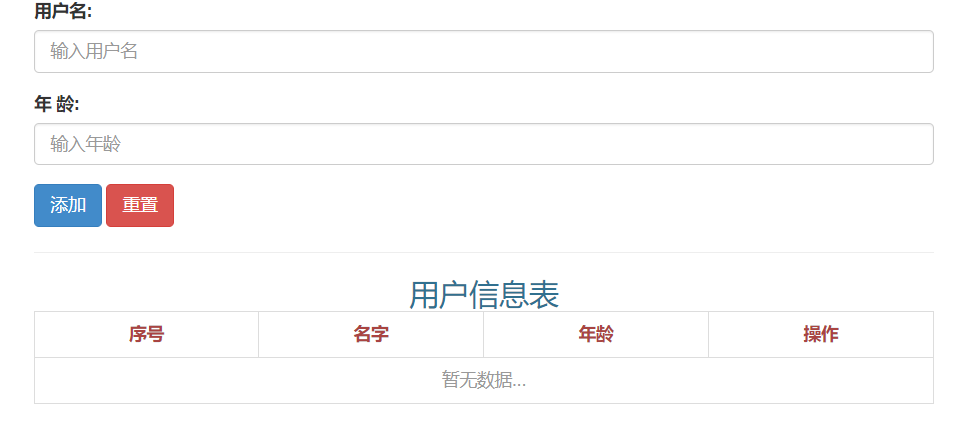

# Vue


## 目录

1. [Vue基本属性及事件](#1)

    - [常用指令、属性绑定及事件绑定](#1a)
    - [bootstrap + Vue实现简易留言](#1b)
    - [模板及过滤器](#1c)
    - [数据交互:vue-resource](#1d)


***


<a name="1">


## Vue基本属性及事件


Vue是一个mvvm框架，一套用于构建用户界面的渐进式框架，Vue的核心库只关注视图层，易于上手。

```
<div id="box">
    {{msg}}
</div>

var app = new Vue({
    el: '#box', //选择器
    data: {
        msg: 'hello Vue'
    },
    methods: {
    
    }
});
```

数据和DOM都是关联的、双向绑定的，所有东西都是响应式的，在控制台修改`app.msg`的值，可以看到上例会相应地更新。


<a name="1a">


### 常用指令、属性绑定及事件绑定


`v-model`: 一般表单元素(input)，双向数据绑定


**循环:**

```
v-for="name in arr"
    获取索引：{{$index}}

v-for="name in json"
    获取索引和key：{{$index}}  {{$key}}

v-for="(k,v) in json"
    获取同时获取key和value：k、v
```


#### 事件触发及绑定

```
v-on:click="函数"

v-on:click/mouseout/mouseover/dblclick/mousedown.....

new Vue({
    el:'#box',
    data:{ //数据
        arr:['apple','banana','orange','pear'],
        json:{a:'apple',b:'banana',c:'orange'}
    },
    methods:{
        show:function(ev){    //方法
            alert(1);
        }
    }
});
```

**简写**的事件绑定:`@click=''`

**事件对象**: `@click='show($event)'`——`$event`

**事件冒泡**:

- 阻止冒泡的方式:
    - `ev.cancelBubble = true;`
    - `@click.stop='show($event)';`

**默认行为(默认事件)**:

- 阻止默认行为的方式:
    - `ev.preventDefault();`
    - `@contextmenu.prevent='show($event)';`

**键盘事件**:

- `@keydown`、`@keyup`
- `ev.keyCode`——键码
- 常用键:
    - 回车:`@keyup.13/@keyup.enter`
    - 上下左右: `@keyup.up/@keyup.down/@keyup.left/@keyup.right`


#### 显示或隐藏

`v-show='true/false'`


#### 属性绑定

`v-bind:src=''`，当然还可以绑定width/height/title...

属性绑定可以简写为`:src=''`

注意:

- `` ——效果可以实现，但是会报404错误。
- `` ——效果可以实现，而且不会发404请求。


**两个特殊的属性绑定:**

`class`: 

- `:class="[red]"`
    - red是data中的数据
    - `:class="[red,a,b,c]"`
  
- `:class="{red:a, blue:false}"`
    - red和blue是类名
    - json格式，key为类名，value为布尔值

- `:class="json"`
    
    ```
    data:{
        json:{red:true, blue:false}
    }
    ```

`style`:

- `:style="[c]"`
- `:style="[c,d]"`
- `:style="json"`
- 注意：复合样式，采用驼峰命名法。


***


<a name="1b">


### bootstrap + Vue实现简易留言


[todolist](./Vuejs/todolist.html)


效果图:




***


<a name="1c">

### 模板及过滤器


#### 模板

`{{msg}}` --> 数据更新、模板变化

`{{*msg}}` --> 数据只绑定一次

`{{{msg}}}` --> HTML不转义输出


#### 过滤器

`{{msg| filterA 参数 | filterB 参数}}`

系统提供一些过滤器，用来过滤模板数据。

```
uppercase // 大写 {{'welcome'| uppercase}}
lowercase // 小写
capitalize // 首字母大写
currency // 转换为相同数目的钱 {{amount | currency ￥}}

```

Vue2.0以后可以将过滤器用在v-bind表达式中:

`<div v-bind:id="rawId | formatId"></div>`


***


<a name="1d">


### 数据交互:vue-resource

如果vue想与后台进行数据交互，需要引入插件`vue-resource`。

用法:

`$http.get/post/jsonp(url[,data][,options]).then(success,error);`

#### GET

获取一个普通文本数据:
```
this.$http.get("a.txt").then(function(res){
    alert(res.data); //请求成功，打印数据
}, function(res){
    alert(res.status); //请求失败
});
```

给服务器发送数据:
```
this.$http.get('get.php', {
    a:1,
    b:2
}).then(function(res){
    alert(res.data);
}, function(res){
    alert(res.status);
});
```


#### POST

```
this.$http.post('post.php', {
    a:1,
    b:2
}, {
    //模拟表单提交
    emulateJSON:true //这一行相当于设置Content-Type为application/x-www-form-urlencoded
}).then(function(res){
    alert(res.data); //-1
}, function(res){
    alert(res.status);
});


//post.php
<?php
$a = $_POST['a'];
$b = $_POST['b'];
echo $a - $b; //php通过echo来返回ajax请求的数据
?>
```


#### jsonp

百度搜索的接口:`https://sp0.baidu.com/5a1Fazu8AA54nxGko9WTAnF6hhy/su?wd=a&cb=jshow`

```
this.$http.jsonp('https://sp0.baidu.com/5a1Fazu8AA54nxGko9WTAnF6hhy/su',{
        wd:'a'
    },{
        jsonp:'cb'  //回调函数的名字(key)，默认key就是"callback"，百度的接口key为cb
    }).then(function(res){
        alert(res.data.s);
    },function(res){
        alert(res.status);
    });
```


