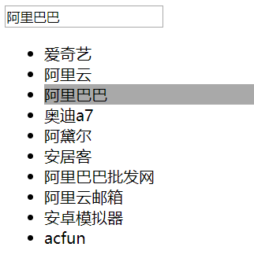
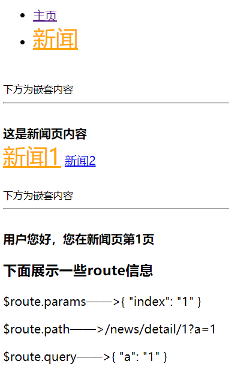
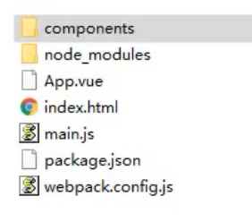
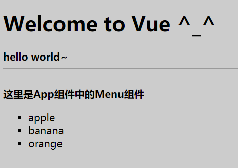
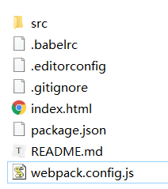

# Vue


## 目录

1. [Vue基本指令、属性及事件](#1)

    - [常用指令、属性绑定及事件绑定](#1a)
    - [bootstrap + Vue实现简易留言](#1b)
    - [模板及过滤器](#1c)
    - [数据交互:vue-resource](#1d)
    - [百度搜索下拉列表](#1e)
    
2. [Vue实例、钩子函数、自定义过滤器及指令](#2)

    - [Vue生命周期钩子函数](#2a)
    - [v-text、v-html、v-cloak](#2b)
    - [计算属性computed](#2c)
    - [Vue实例属性及方法](#2d)
    - [循环数据排序处理及自定义过滤器](#2e)
    - [自定义指令](#2f)
    - [自定义键盘事件](#2g)
    - [bower的使用](#2h)
    - [Vue中的过渡和动画](#2i)

3. [Vue组件及数据传递与更新](#3)

    - [监听数据变化](#3a)
    - [组件的创建和使用](#3b)
    - [组件配合模板及动态组件](#3c)
    - [组件数据传递](#3d)
    - [插槽slot](#3e)

4. [Vue1.0中vue-router的使用](#4)

    - [vue-router使用流程](#4a)
    - [路由嵌套](#4b)
    - [vue-router构建一个简单的SPA](#4c)

5. [Vue2.0中vue-loader的使用](#5)

    - [App.vue](#5a)
    - [main.js](#5b)
    - [index.html](#5c)
    - [package.json和webpack.config.js](#5d)
    - [一些注意点](#5e)

6. [Vue2.0语法、指令、组件变化](#6)

    - [Vue2.x和Vue1.x的区别](#6a)
    - [Vue2.x组件通信](#6b)

7. [Vue2.0过渡及其钩子函数](#7)

    - [Vue2.x过渡(动画)](#7a)
    - [transition事件的钩子函数](#7b)
    - [与animate.css配合、多元素过渡](#7c)

8. [Vue2.0中vue-router的使用](#8)

    - [基本使用](#8a)
    - [路由嵌套](#8b)
    - [Vue脚手架vue-cli](#8c)


***


<a name="1">


## Vue基本属性及事件


Vue是一个mvvm框架，一套用于构建用户界面的渐进式框架，Vue的核心库只关注视图层，易于上手。

```
<div id="box">
    {{msg}}
</div>

var app = new Vue({
    el: '#box', //选择器
    data: {
        msg: 'hello Vue'
    },
    methods: {
    
    }
});
```

数据和DOM都是关联的、双向绑定的，所有东西都是响应式的，在控制台修改`app.msg`的值，可以看到上例会相应地更新。


<a name="1a">


### 常用指令、属性绑定及事件绑定


`v-model`: 一般表单元素(input)，双向数据绑定。


**循环:**

```
v-for="name in arr"
    获取索引：{{$index}}

v-for="name in json"
    获取索引和key：{{$index}}  {{$key}}

v-for="(k,v) in json"
    获取同时获取key和value：k、v
```


#### 事件触发及绑定

```
v-on:click="函数"

v-on:click/mouseout/mouseover/dblclick/mousedown.....

new Vue({
    el:'#box',
    data:{ //数据
        arr:['apple','banana','orange','pear'],
        json:{a:'apple',b:'banana',c:'orange'}
    },
    methods:{
        show:function(ev){    //方法
            alert(1);
        }
    }
});
```

**简写**的事件绑定:`@click=''`

**事件对象**: `@click='show($event)'`——`$event`

**事件冒泡**:

- 阻止冒泡的方式:
    - `ev.cancelBubble = true;`
    - `@click.stop='show($event)';`

**默认行为(默认事件)**:

- 阻止默认行为的方式:
    - `ev.preventDefault();`
    - `@contextmenu.prevent='show($event)';`

**键盘事件**:

- `@keydown`、`@keyup`
- `ev.keyCode`——键码
- 常用键:
    - 回车:`@keyup.13/@keyup.enter`
    - 上下左右: `@keyup.up/@keyup.down/@keyup.left/@keyup.right`


#### 显示或隐藏

`v-show='true/false'`


#### 属性绑定

`v-bind:src=''`，当然还可以绑定width/height/title...

属性绑定可以简写为`:src=''`

注意:

- `` ——效果可以实现，但是会报404错误。
- `` ——效果可以实现，而且不会发404请求。


**两个特殊的属性绑定:**

`class`: 

- `:class="[red]"`
    - red是data中的数据
    - `:class="[red,a,b,c]"`
  
- `:class="{red:a, blue:false}"`
    - red和blue是类名
    - json格式，key为类名，value为布尔值

- `:class="json"`
    
    ```
    data:{
        json:{red:true, blue:false}
    }
    ```

`style`:

- `:style="[c]"`
- `:style="[c,d]"`
- `:style="json"`
- 注意：复合样式，采用驼峰命名法。


***


<a name="1b">


### bootstrap + Vue实现简易留言


[todolist](./Vuejs/todolist.html)


效果图:


***


<a name="1c">

### 模板及过滤器


#### 模板

`{{msg}}` --> 数据更新、模板变化

`{{*msg}}` --> 数据只绑定一次

`{{{msg}}}` --> HTML不转义输出


#### 过滤器

`{{msg| filterA 参数 | filterB 参数}}`

系统提供一些过滤器，用来过滤模板数据。

```
uppercase // 大写 {{'welcome'| uppercase}}
lowercase // 小写
capitalize // 首字母大写
currency // 转换为相同数目的钱 {{amount | currency ￥}}

```

Vue2.0以后可以将过滤器用在v-bind表达式中:

`<div v-bind:id="rawId | formatId"></div>`


***


<a name="1d">


### 数据交互:vue-resource

如果vue想与后台进行数据交互，需要引入插件`vue-resource`。


用法一:

`$http.get/post/jsonp(url[,data][,options]).then(success,error);`

用法二:

```
`$http({
    url:URL,
    data:{},
    method:'get/post/jsonp',
    jsonp:'cb'//cbName
});`
```


#### GET

获取一个普通文本数据:
```
this.$http.get("a.txt").then(function(res){
    alert(res.data); //请求成功，打印数据
}, function(res){
    alert(res.status); //请求失败
});
```

给服务器发送数据:
```
this.$http.get('get.php', {
    a:1,
    b:2
}).then(function(res){
    alert(res.data);
}, function(res){
    alert(res.status);
});
```


#### POST

```
this.$http.post('post.php', {
    a:1,
    b:2
}, {
    //模拟表单提交
    emulateJSON:true //这一行相当于设置Content-Type为application/x-www-form-urlencoded
}).then(function(res){
    alert(res.data); //-1
}, function(res){
    alert(res.status);
});


//post.php
<?php
$a = $_POST['a'];
$b = $_POST['b'];
echo $a - $b; //php通过echo来返回ajax请求的数据
?>
```


#### jsonp

百度搜索的接口:`https://sp0.baidu.com/5a1Fazu8AA54nxGko9WTAnF6hhy/su?wd=a&cb=jshow`

```
this.$http.jsonp('https://sp0.baidu.com/5a1Fazu8AA54nxGko9WTAnF6hhy/su',{
        wd:'a'
    },{
        jsonp:'cb'  //回调函数的名字(key)，默认key就是"callback"，而百度的接口key为cb
    }).then(function(res){
        alert(res.data.s);
    },function(res){
        alert(res.status);
    });
```


***


<a name="1e">

### 百度搜索下拉列表

利用jsonp制作一个简单的搜索功能:

[百度搜索下拉列表](./Vuejs/baidu_search.html)


实现效果图:




***


<a name="2">


## Vue实例、钩子函数、自定义指令


<a name="2a">


### Vue钩子函数

在Vue的整个生存周期中，有这么一些钩子函数，来标志不同状态的Vue:

- `init` ——> 实例已经初始化

- `created` ——> 实例已经创建

- `beforeCompile` ——> 编译之前

- `compiled` ——> 编译之后

- `ready` ——> $el插入到文档中

- `beforeDestroy` ——> 销毁之前

- `destroyed` ——> 销毁之后

注意：此处是Vue 1.0

```
var vm = new Vue({
    el: '#box',
    data:{
        msg:'well'
    },
    methods:{
    },
    created:function(){
        alert('实例已经创建');
    },
    beforeCompile:function(){
        alert('编译之前');
    },
    compiled:function(){
        alert('编译之后');
    },
    ready:function(){
        alert('插入到文档中');
    }
    
    // 下面两个钩子函数只有销毁vue实例对象时才会执行
    // 销毁方法: vm.$destroy();
    beforeDestroy:function(){
        alert('销毁之前');
    },
    destroyed:function(){
        alert('销毁之后');
    }
});
```


生命周期图示:


<a name="2b">


### v-text、v-html、v-cloak

某些时候运行卡顿，向文档插入比较大的段落时，用户可能会看到文档插入之前的花括号标记闪烁，影响体验。

有以下几种途径解决:

- `v-cloak`: 这个指令保持在元素上直到关联实例结束编译。

    示例:常与display进行连用
    
    ```
    [v-cloak] {
        display:none;
    }
    
    <div v-cloak>
        {{message}}
    </div>
    ```

- `v-text`: 这个用来进行数据绑定，更新元素的textContent，用户不会看到花括号。

    ```
    <span v-text="msg"></span>
    <!-- 和下面的一样 -->
    <span>{{msg}}</span>
    ```


- `v-html`: 用来更新元素的innerHTML，内容按照普通HTML插入，而不会作为Vue模板进行编译。

    ```
    <div v-html="html"></div>
    <!-- 和下面的一样 -->
    <div>{{{html}}}</div>
    ```


<a name="2c">


### 计算属性computed

适用于一些场景: 改变a的值，b的值也要自动相应进行变化。

```
var vm = new Vue({
    el:'#box',
    data:{
        a:1
    },
    computed: {
        //这里面放的是b属性，而不是方法
        //仅读取
        b:function(){
            //业务逻辑代码
            return this.a + 1;
        }
    }
});
```


**计算属性的操作方法:**

```
computed: {
    // 计算属性实际上是一个对象
    b:{
        //读取
        get:function(){
            return this.a + 1;
        },
        //设置
        set: function(val){
            this.a = val;
        }
    }
}
```

当直接给b设置function(){return a+1}，调用的是get方法，值为return的结果。

当给b重新赋值，调用的是set方法，如`vm.b=10`会将`this.a`设置为10，接着b也会变化为11。


***


<a name="2d">


### Vue实例属性

- `vm.$el`: Vue实例使用的根DOM元素。

- `vm.$data`: Vue实例观察的数据对象。Vue 实例代理了对其 data 对象属性的访问，即可以通过vm.attr来访问。

- `vm.$options`: 包含了自定义的属性或方法(即定义在data之外的属性)，获取自定义属性需要通过vm.$options.attr来访问。


#### 实例方法:

- `vm.$mount()`: 用来手动的挂载一个未挂载的实例(即没有指定el选项的实例)。返回值为实例自身，可以链式调用其他实例方法。

    示例: `var vm = new Vue().$mount('#box');`


- `vm.$destroy()`: 完全销毁一个实例。清理它与其它实例的连接，解绑它的全部指令及事件监听器。


- `vm.$log()`: 查看现在data中数据的状态。


***


<a name="2e">


### 循环数据排序处理及自定义过滤器


#### v-for的数据处理

`v-for="value in data"`

如果有重复数据，不会显示，并且会报错。

可以使用`track-by='索引'`来提高循环性能或排序。

```
data:{
  items: [
    { _uid: '88f869d', ... },
    { _uid: '7496c10', ... }
  ]
}

<div v-for="item in items" track-by="_uid">
  <!-- content -->
</div>
```

如果没有一个独特的key，可以使用`track-by='$index'`。

**性能的改善:**

无track-by情况：数据修改时，无论值是否被修改，dom都被重新渲染（控制台可以看到）。

加入track-by属性：数据修改时，不变数据所在的dom不被重新渲染，已改变的数据所在dom才被重新渲染。


***


#### vue过滤器及自定义过滤器


除了之前介绍的capitalize、lowercase、uppercase、currency过滤器，还有一些强大的过滤器。


- `debounce` —— 配合事件、延迟执行。

    如:`@keyup="showMsg() | debounce 2000"` 将事件触发的函数延迟2秒执行。

- `json` —— 将js对象转换为json数据输出。
    
    相当于`JSON.stringify()`方法。


**配合数据使用的过滤器:**

- `limitBy <取几个> <从何处开始>`

    如：取数组中最后两条数据。

    `v-for="val in arr | limitBy 2 arr.length-2"`

- `filterBy <keyword>` 用来过滤数据。

    可以用来在数组中获取含有关键字kw的数据。

- `orderBy <kw> 1/-1` 用来给数据按关键字进行排序。

    1为正序，2为倒序。不加关键字，默认按首字母排序。


**自定义过滤器:**

`Vue.filter(name, function(input){});`

使用示例:
```
Vue.filter('toDou', function(input, a, b){
    alert(a + ',' + b);
    return input<10?'0'+input:''+input;
});
```

以上代码自定义了一个过滤器名为`toDou`，用来将个位数格式化为两位数。

在过滤器后可以跟多个参数: `{{a | toDou 1 2}}` ，a为第一个参数，1为第二个，2为第三个...


**自定义一个过滤器，用来将时间戳转换为日期时间:**

```
Vue.filter('date', function(time){
    //注意这里传入的时间戳单位是毫秒
    var oDate = new Date(time);
    return oDate.getFullYear()+'-'+(oDate.getMonth()+1)+'-'+oDate.getDate()+' '+oDate.getHours()+':'+oDate.getMinutes()+':'+oDate.getSeconds();
})
```

还可以结合之前的`toDou`来将日期时间格式化为两位数。


**一般过滤器: model --> 过滤 --> view**

**双向过滤器:**

    ```
    Vue.filter('filterHtml',{
                read:function(input){ //model -> view
                    return input.replace(/<[^<]+>/g,'');
                },
                write:function(val){ //view -> model
                    return val;
                }
    });
    ```

数据和视图双向过滤:

    model -> view

    view -> model


***


<a name="2f">


### 自定义指令


Vue中的指令是用来扩展html语法的，类似一种Decorator模式，用来往某个组件上添加或增强功能。

在自定义指令时，注意名称的写法: v-red -> red，使用时必须加v，定义时不需要加。

**自定义拖拽指令:**

```
Vue.directive('drag', function(){
    //通过this.el获取指令所在的原生DOM元素
    var oDiv = this.el;
    oDiv.onmousedown = function(ev){
        var locX = ev.clientX - oDiv.offsetLeft;
        var locY = ev.clientY - oDiv.offsetTop;
        
        document.onmousemove = function(ev){
            oDiv.style.left = ev.clientX - locX + "px";
            oDiv.style.top = ev.clientY - locY + "px";
        };
        
        document.onmouseup = function(ev){
            document.onmousemove = null;
            document.onmouseup = null;
        };
    };
})

window.onload=function(){
    var vm=new Vue({
        el:'#box',
        data:{
        }
    });
};

<div id="box">
    <div v-drag :style="{width:'100px', height:'100px', background:'blue', position:'absolute', right:0, top:0}"></div>
    <div v-drag :style="{width:'100px', height:'100px', background:'red', position:'absolute', left:0, top:0}"></div>
</div>
```

如上，用`directive`定义完拖拽指令`drag`后，在元素中添加`v-drag`属性即可实现拖拽功能。

**注意，在Vue中给元素的属性指令赋值要用引号，即使该值为变量**，也要引起来:

`:style="json"`，

而如果是数据，则要给数据中除纯数字以外的属性值再加上引号。

`:style="{width:'100px'}"`


***


**自定义带参数的指令:**


```
Vue.directive('red',function(color){
    this.el.style.background=color;
});

<div v-red="参数">这是一行添加了指令效果的文字</div>
```

- 如果是直接传入color的话，一定要再加一层引号！

    `<div v-red="'red'">这是一行添加了指令效果的文字</div>`


- 如果是传入一个变量的话，需要在data中定义:

    ```
    data:{
       a:'blue'
    }
    
    <div v-red="a">这是一行添加了指令效果的文字</div>
    ```


***


<a name="2g">

### 自定义键盘事件

可以给键盘上的一些键添加一个简单的名称，然后通过类似`@keydown.enter`的方法来使用。

可以通过`@keydown.a/b/c/d...`来使用字母按键，但是ctrl和alt等按键默认只能通过keyCode来使用。

下面自定义一个别名，用来绑定ctrl按键的事件:

```
Vue.directive('on').keyCodes.myctrl = 17;
```

接下来就可以通过`@keydown.myctrl=""`来操作该事件了。

还可以加上过滤器: `@keydown.myctrl="show | debounce 2000"`。


***


<a name="2h">


### bower的使用

bower是前端的一个包管理器，类似于npm，但npm主要用于后端node。

安装:

`npm install bower -g`

验证: `bower --version`

使用:

```
bower install <包名>
bower uninstall <包名>
bower info <包名>     查看包版本信息
```

可以用bower来安装vue.js、animate.css等各种库。

如果要安装vue1.0的最新版，`bower install vue@1`即可。

使用刚安装的vue:

`<script src="bower_components/vue/dist/vue.js"></script>`


***


<a name="2i">


### Vue中的过渡和动画

在Vue中使用过渡(动画)transition，本质上也是使用CSS3的`transition`和`animation`。

基本使用方法:

```
<button @click='bSign=false'>按钮</button>
<div v-show="bSign" transition="fade"></div>

data:{bSign:true}

//动画：在style中定义
.fade-transition {
    transition: 1s all ease;
}

//设置进入效果:
.fade-enter {
}
//设置离开效果
.fade-leave {
    opacity:0;
    transform:translateX(200px);
}
```

当点击按钮后，这个div将会在1秒内右移200px同时渐渐消失。


**高级动画用法:**

下载animate.css并引入: `bower install animate.css`。

```
<link rel="stylesheet" href="bower_components/animate.css/animate.css">

//给元素加上类名animated，相当于引入了animate.css中的各种动画
//后面只需给enterClass和leaveClass赋予效果即可
<div class="animated" v-show="bSign" transition="myBounce"></div>
```

使用动画:

在Vue中使用，写在transitions属性中。

`enterClass`和`leaveClass`必写。

```
new Vue({
    el:'body',
    data:{bSign:true},
    methods:{},
    transitions:{
        //这里面定义所有动画，直接使用animate.css中的效果
        myBounce:{
            enterClass:'zoomInLeft',
            leaveClass:'zoomOutRight'
        }
    }
});
```


***


<a name="3">


## Vue组件及数据传递与更新


<a name="3a">


### 监听数据变化

之前我们通过计算属性`computed`实现了数据的同步变化。

现在我们用更好的方法来实现**监听数据变化**，进而同步变化其他数据。

Vue实例方法:`vm.$watch(name, callback, [options])`

使用示例:

```
data:{
    a:1,
    b:2
}

vm.$watch('a', function(newVal, oldVal){
    //会在数据a变化时执行该函数
    alert('发生变化了');//此时页面中没有效果变化
    this.b = 23333;
    //数据a变化的效果会和该函数的效果在函数执行完毕后一同展现
})

document.onclick = function(){vm.a=1;};
```


**取消监听**

`vm.$watch()`返回一个取消观察函数，取消监听可以执行它来实现:

    ```
    var unwatch = vm.$watch('a',cb); 
    unwatch();
    ```


**传入可选参数**

当监听的数据是一个对象时，如果还是像上面进行设置，则里面的元素变化并不会触发回调函数。

需要传入一个可选的参数: `deep`，来深度监听。

```
vm.$watch(name, callback, {deep:true});
```


关于`vm.$watch()`详情请看官方文档: [watch](https://cn.vuejs.org/v2/api/#vm-watch)


***


<a name="3b">


### 组件的定义和使用


#### 创建组件

- **全局组件**:

    ```
    // 定义一个名为 button-counter 的新组件
    Vue.component('button-counter', {
      data: function () { //注意data必须是一个返回数据对象的函数
        return {
          count: 0
        }
      },
      template: '<button v-on:click="count++">You clicked me {{ count }} times.</button>'
    })
    ```


- **局部组件**:

    ```
    //一般局部组件是放在某个组件的内部
    var vm = new Vue({
        el:'#box',
        data:{},
        components:{
            //可以放置多个局部组件
            'my-Com':{
                template:'<h2>标题2</h2>'
            }
        }
    });
    ```


组件是可复用的 Vue 实例，且带有一个名字。

它们与 new Vue 接收相同的选项，例如 data、computed、watch、methods 以及生命周期钩子等。仅有的例外是像 el 这样根实例特有的选项。


#### 组件复用


```
//同时多次使用一个组件
<div id="components-demo">
  <button-counter></button-counter>
  <button-counter></button-counter>
  <button-counter></button-counter>
</div>
```

注意当点击按钮时，每个组件都会各自独立维护它的 count。
因为你每用一次组件，就会有一个它的新实例被创建，又由于data是以函数的形式存在，所以每个组件实例内部的数据独立。


***


<a name="3c">


### 组件配合模板及动态组件


**配合模板:**

- 方式一:

    如之前展示的，紧接着template属性后写上语句。

    `template:'<h2 @click="change">标题2->{{msg}}</h2>'`

- 方式二:

    将模板代码单独放到某个地方，然后给template指定id号:`template:'#id'`
    
    ```
    <script type='x-template' id="myCom">
        <h2 @click="change">标题2->{{msg}}</h2>
    </script>
    ```

    或者:
    
    ```
    //放到body中:
    <template id="myCom">
        <h1>标题1</h1>
        <ul>
            <li v-for="val in arr">
                {{val}}
            </li>
        </ul>
    </template>
    ```


**动态组件:**


Vue中可以设置一个动态组件，随时调整。

`<component :is="组件名称"></component>`

给组件名称赋一个变量，然后就可以动态的调整切换组件了。

```
<div id="box">
<component :is="myCom"></component>
</div>

new Vue({
    el:'#box',
    data:{
        myCom:'a'; //在这里修改组件名即可切换组件。
    },
    components:{
        'a':{
            template:'<h2>我是a组件</h2>'
        },
        'b':{
            template:'<h2>我是b组件</h2>'
        }
    }
});
```


***


<a name="3d">


### 组件数据传递


> 可以给Chrome安装一个工具`vue-devtools`，利用它来调试Vue组件。


默认情况下，子组件无法访问父组件的数据。


如何在父子组件间进行数据传递？

- **子组件要获取父组件的数据:**

    ```
    //父组件模板中嵌套调用子组件
    <template id="aaa">
        //子组件中接收父组件的数据msg，并绑定为属性
        <bbb :p="msg"></bbb> //给子组件中的属性p绑定数据msg(已经在props中定义)
    </template>
    
    new Vue({
        el:'#box',
        data:{},
        components:{
            'aaa':{
                data:function(){
                    return {
                        msg: '我是父组件中的数据'
                    }
                },
                template:'#aaa',
                // 这是父组件里的子组件
                components:{
                    'bbb':{
                        //在子组件中注册一些自定义的属性
                        props:['p'],
                        // 将从父组件接收来的数据使用在自己的模板里
                        template:'<h3>我是bbb组件>{{p}}</h3>'
                    }
                }
            }
        }
    });  
    ```

- **父组件获取子组件数据:**

    需要子组件把自己的数据发送到父组件: `vm.$emit(事件名, 数据);`，然后父组件给事件绑定函数，函数的参数就是传过来的数据。
    
    **在子组件中发送数据:**

    ```
    'bbb':{
        data:function(){
            return {
                bMsg:'我是子组件中的数据'
            }
        },
        template:'#bbb',
        methods:{
            //定义一个方法send，在其中发送数据
            send:function(){
                //在这里以事件的形式发送自己的数据
                this.$emit('child-msg', this.bMsg);
            }
        }
    }
    
    //子组件模板
    <template id="bbb">
        <h2>子组件</h2>
        <input type='button' value='发送' @click="send">
    </template>
    //当点击发送后，就会把数据以child-msg事件形式传递给父组件，作为该事件绑定函数的参数存在
    ```

    **在父组件中接收数据:**

    ```
    //使用父组件
    <div id="box">
        <aaa></aaa>
    </div>
    
    //定义父组件模板
    <template id="aaa">
        //父组件中嵌套使用子组件，同时给child-msg绑定函数
        <bbb @child-msg='get'></bbb>
    </template>
    
    //在父组件中定义方法
    'aaa':{
        data:function(){return {}},
        template:'#aaa';
        methods:{
            //这个函数的参数就是子组件传递过来的数据！
            get:function(msg){
                alert(msg);
            }
        }
    }
    
    ```


***


<a name="3e">


### 插槽slot

slot: 位置、槽口，用来占位。

Vue实现了一套内容分发的api，并将slot元素作为承载分发内容的出口。


之前我们定义完组件后，是这样使用的:

```
<div id="box">
    <aaa></aaa>
</div>
```

而如果我们在aaa标签中间插入内容，是不会显示出来的。
若有这么一个需求，要能够在使用组件时自由地往组件模板中插入内容，这时可以使用`slot`。


#### 使用`slot`:默认插槽

定义组件时，用slot占位:

```
<template id="aaa">
    <h1>XXX</h1>
    <slot>当没有往aaa标签间插入内容时，会默认显示这行字</slot>
    <p>Welcome Vue</p>
</template>
```

若使用组件时，在标签中间插入内容，则会将slot元素替换为插入的内容。

**可以同时使用多个slot元素**，这样插入的内容会重复多次。


#### 多个`slot`:具名插槽


若需要有选择的插入不同内容并替换slot元素，该如何做呢？

使用具名插槽:

```
//定义模板:
<template id="aaa">
    <h1>XXX</h1>
    <slot name='ol-slot'>当没有往aaa标签间插入内容时，会默认显示这行字1</slot>
    <p>Welcome Vue</p>
    <slot name='ul-slot'>当没有往aaa标签间插入内容时，会默认显示这行字2</slot>
</template>

//使用组件:
<aaa>
    //将会替换name为ul-slot的插槽
    <ul slot="ul-slot">
        <li>111<li>
        <li>222<li>
        <li>333<li>
    </ul>
    //将会替换name为ol-slot的插槽
    <ol slot="ol-slot">
        <li>111<li>
        <li>222<li>
        <li>333<li>
    </ol>
</aaa>
```


***


<a name="4">


## Vue-router(适用于vue1.0)


在使用之前，需要下载安装:`bower install vue-router@0`。

因为目前学的是Vue1.0，所以使用的Vue-router是0.x版本的。而Vue2.0对应的vue-router是2.x版本。


之前用`vue-resource`实现交互，现在可以用`vue-router`实现路由功能。

将组件映射到路由，然后告诉`vue-router`在哪里渲染它们。


<a name="4a">


### vue-router使用流程(Vue1.x)

html:

```
//vue中不再使用a中的href，而是使用指令v-link，并设置路径
<a v-link="{path:'/home'}">主页</a>   //跳转链接
<a v-link="{path:'/news'}">新闻</a>   //跳转链接

//展示内容:
<router-view></router-view>

//定义组件模板
<template id="home">
    <h3>我是主页</h3>
</template>

<template id="news">
    <h3>我是新闻页</h3>
</template>

```

js:

```
//1. 准备一个根组件
var App=Vue.extend();

//2. Home、News组件也需要准备
var Home=Vue.extend({
    template:'#home'
});

var News=Vue.extend({
    template:'#news'
});

//3. 准备路由
var router=new VueRouter();

//4. 路由关联组件
router.map({
    'home':{
        component:Home
    },
    'news':{
        component:News
    }
});

//5. 启动路由
router.start(App,'#box');

//还可以设置重定向:
router.redirect({
    '/':'/home'
});
```

还可以给匹配成功的url添加样式:

`.v-link-active {color:red;}`

这样当点击跳转主页或新闻时，相应的链接文字样式会发生变化。


<a name="4b">


### 路由嵌套

如果在上面的流程中，主页需要再进行路由嵌套:

```
主页:home
  - 登录 home/login
  - 注册 home/reg
```

则需使用`subRoutes`:

```
router.map({
    '/home':{
        component:Home,
        subRoutes:{
            '/login':{
                component:{
                    template:'<strong>这是登录信息</strong>'
                }
            },
            '/reg':{
                component:{
                    template:'<strong>这是注册信息</strong>'
                }
            }
        }
    }
});
```

**如何提取URL中的参数和查询字符？**

如: 访问url`/home/login/Tom?a=1`

可以向路由中设置变量来接收参数:

```
subRoutes:{
    //设置变量name来接收参数Tom
    '/login/:name':{
        component:{
            template:'<strong>我是登录信息 {{$route.params.name}}</strong>'
            //会打印: 我是登录信息 Tom
        }
    }
}
```

- 可以通过`$route.params`来接收参数对象:`{{$route.params | json}}`——>`{"name":"Tom"}`

- 可以通过`$route.path`来接收当前路径: `{{$route.path}}`——>`/home/login/Tom?a=1`

- 可以通过`$route.query`来接收查询参数对象:`{{$route.query | json}}`——> `{"a":"1"}`

**注意是$route而不是$router!**


***


<a name="4c">


### vue-router构建一个简单的SPA


[myFirstSPA](./Vuejs/mySPA.html)


效果图:




***


<a name="5">


## vue-loader(基于vue2.0版本)


官方文档: [https://vue-loader.vuejs.org/guide/](https://vue-loader.vuejs.org/guide/)

一个vue中模块化加载的工具，用来加载解析模块化组件:`.vue`文件。

类似其他loader ——> css-loader、url-loader、html-loader...


前端的模块化打包之前学过有`browserify`来实现，但是它只能实现js文件的模块化。

- `webpack`: 模块打包器，一切文件都是模块。可以识别代码使用的模块化规范，然后获取依赖，进行转换、编译、打包。因为webpack本身是一个node模块，所以`webpack.config.js`是以`commonjs`形式书写的。

- `vue-loader`是基于`webpack`的。


使用了`vue-loader`的项目目录:




简单目录结构:

    |-index.html        主页
    |-main.js           入口文件
    |-App.vue           主应用组件
    |-package.json      工程文件（项目依赖、名称、配置），可以npm init --yes生成
    |-webpack.config.js  webpack的配置文件


***


<a name='5a'>


### `.vue`文件


`.vue`文件放置的是特定格式的vue组件代码，`vue-loader`可以将其转换为正常的模块代码。
又因为`.vue`文件中或外部有template代码、有js代码、有css代码，因此还需要一些加载器:
`vue-html-loader`、`babel-loader`、`css-loader`、`vue-style-loader`、`vue-template-compiler`、`vue-hot-reload-api`，
有vue前缀的加载器都是`vue-loader`的扩展，用来处理`.vue`文件中的各种代码。

`.vue`中代码一般有三块:`template、script、style`:

```
<template>
<!--放置的是该组件的模板-->
<h1 @click="change">{{msg}}<h1>
</template>

<script>
//放置的是该组件的定义代码，虽然用的是ES6的模块语法，但是其内部写法还是component。
export default{
    data(){
        return {
            msg: 'welcome Vue ^_^'
        }
    },
    methods:{
        change(){
            this.msg = 'hello world';
        }
    }
}
</script>

<style>
/*放置样式代码*/
body{
    background: #ccc;
}
</style>
```


`App.vue`是主应用组件，可以往里面加入其它小组件:

新建一个目录: components，用来放置各种小组件。

components中的Menu.vue:

    ```
    <template>
        <ul>
            <li>111<li>
            <li>222<li>
            <li>333<li>
        </ul>
    </template>
    <script>
    </script>
    ```

在主组件App.vue中引入:

```
<script>
    //所有的文件都是模块，vue组件当然也是，因此可以import导入
    import Menu from './components/Menu.vue'
    export default{
        data(){
            return {
                msg:'welcome Vue ^_^'
            }
        },
        methods:{
            change(){
            this.msg = 'hello world';
            }
        },
        //注册子组件
        components:{
            'my-menu':Menu
        }
    }
</script>

<template>
    <h1 @click="change">{{msg}}<h1>
    <!--使用子组件Menu.vue-->
    <my-menu></my-menu>
</template>
```


***


<a name="5b">


### `main.js`

`main.js`是入口文件，在这里面创建一个Vue实例，可以进行一系列操作，并注册`App.vue`组件。

```
import Vue from 'vue/dist/vue.js'
import App from './App.vue'

new Vue({
    el:'body',
    components:{
        'app':App
    }
});
```

***


<a name="5c">


### `index.html`

这是整个项目的主页，在这里需要的只是引入主应用组件和经过打包过后的模块入口文件。

```
<body>
    //使用App.vue组件
    <app></app>
    
    // 经过webpack打包后的模块文件入口
    <script src="bundle.js"></script>
</body>
```

`bundle.js`文件需要webpack运行并编译打包之后才能得到引入。


***


<a name="5d">


### `package.json`和`webpack.config.js`


`package.json`直接通过`npm init --yes`即可生成雏形，接下来我们还需要下载很多包，会在里面写入依赖。

- `npm install <包名> -D` 相当于`--save-dev`，写入`devDependencies`.

- `npm install <包名> -S` 相当于`--save`，写入`Dependencies`.

此处除了vue.js是生产环境依赖，其余的都在开发环境下安装。

为了便于相关文档的查找与学习，此处用的是vue2.x，其他相关依赖包也是较新版本。

**依赖包清单:**

```
"dependencies": {
    "vue": "^2.5.16"
  },
"devDependencies": {
    "babel-core": "^6.26.3",
    "babel-loader": "^7.1.4",
    "css-loader": "^0.28.11",
    "vue-hot-reload-api": "^2.3.0",
    "vue-html-loader": "^1.2.4",
    "vue-loader": "^15.0.9",
    "vue-style-loader": "^4.1.0",
    "vue-template-compiler": "^2.5.16",
    "webpack": "^4.8.1",
    "webpack-cli": "^2.1.3",
    "webpack-dev-server": "^3.1.4"
  }
```

- `babel-core`、`babel-loader`用来编译加载js文件及`.vue`文件中的`script`片段。

- `css-loader`、`vue-style-loader`用来编译加载css文件及`.vue`文件中的`style`片段。

- `vue-html-loader`、`vue-template-compiler`用来编译加载`.vue`文件中的模板片段。

- `vue-loader`用来编译加载`.vue`文件，前缀名为vue的加载器都是`vue-loader`的扩展。

- `vue-hot-reload-api`能够帮助我们运行调试，它会热加载，实时地对我们修改的内容部分渲染并显示。

- `webpack`相关的不用多说，模块化打包必需的。


**`package.json`相关包安装完毕，接下来需要配置`webpack`。**


**webpack.config.js:**

```
//从vue-loader包中引入插件，以便在webpack中使用vue-loader
const VueLoaderPlugin = require('vue-loader/lib/plugin');

module.exports = {
    //设置为开发环境
    mode:'development',
    //模块文件入口
    entry:'./main.js',
    //模块化编译打包输出
    output:{
        path:__dirname,
        filename:'bundle.js'
    },
    module:{
        //对于不同的模块采用不同的加载器
        rules:[
           {
               test:/\.vue$/,
               loader:'vue-loader'
           },
           {
               test:/\.js$/,
               loader:'babel-loader',
               //用来排除掉一些不需要编译解析的js文件
               exclude:file=>(/node_modules/.test(file) && !/\.vue\.js/.test(file))
           },
           {
               test:/\.css$/,
               use:['vue-style-loader','css-loader']
           }
        
        ]
    },
    //这里必须给webpack注册vue-loader的插件，否则无法运行
    plugins:[
        //make sure to include the plugin for the magic
        new VueLoaderPlugin()
    ]
}
```


至此webpack基本配置完毕，执行webpack指令打包:

`./node_modules/.bin/webpack -p`

或者在`scripts`中加入`"build":"webpack -p"`，执行`npm run build`。

然后在项目目录下会生成一个打包完毕的`bundle.js`文件，由于`index.html`事先写了引入的代码，所以可以直接点击`index.html`看到效果。


***


#### `webpack-dev-server`

上面已经利用webpack打包生成文件`bundle.js`，但如果我们修改了代码则需要重新打包，调试代码比较麻烦。

之前我们安装了`webpack-dev-server`，这是一个小型的`Nodejs Express`服务器，可以利用它来调试自己的代码而不必反复打包。

**注意:**

使用`webpack-dev-server`生成的包并没有放在真实目录中，也就是说在当前目录中不会生成`bundle.js`，而是放在了内存中。


为了方便的执行webpack指令进行编译加载运行，可以在`package.json`的`scripts`中加入:

```
"scripts": {
    "dev": "webpack-dev-server --inline --hot --port 7788"
}
//指定了webpack-dev-server服务器端口为7788
//--inline --hot就是利用了vue-hot-reload-api包的热替换，修改代码后不必刷新即可看到效果
// 如果是其他的server，要实现热替换，就需要在webpack.config.js中增加HotModuleReplacementPlugin了
```


然后可以通过指令`npm run dev`来启动服务器了。

在地址栏中输入:`localhost:7788`即可访问主页。

效果图:




附上项目文件目录:[vue-loader-demo](./Vuejs/vue-loader-demo)


***


<a name="5e">


### 一些注意点

- 组件component的模板中必须有一个根节点，否则会报错:

    ```
    //报错
    <template>
        <h2></h2>
        <p></p>
    </template>
    
    //不报错
    <template>
        <div>
            <h2></h2>
            <p></p>
        </div>
    </template>
    ```

- 在新版的`vue-loader`中，如果要基于`webpack`使用，需要在`webpack.config.js`设置:

    ```
    const VueLoaderPlugin = require('vue-loader/lib/plugin')
    
    //必须要在plugins选项中添加一个实例化的VueLoaderPlugin，否则报错
    plugins:[
        new VueLoaderPlugin()
    ]
    ```

- 在`App.vue`中引入vue时:`import Vue from 'vue'`，这样默认导入的vue是`runtime`版本，没有编译器功能。

    - 正确的引入方法是: `import Vue from 'vue/dist/vue.js'`
    - 详细请看文档:[不同构建版本的解释说明](https://vuefe.cn/v2/guide/installation.html#不同构建版本的解释说明)


- 在`index.html`中引入`bundle.js`时，注意要把`script`元素放在`body`的最后，不然`main.js`中的`Vue`实例会找不到`el`元素。


***


<a name="6">


## vue2.0语法、指令、组件变化

不同于 Vue 1.x，所有的挂载元素会被 Vue 生成的 DOM 替换。
因此不推荐挂载 root 实例到 `<html>` 或者 `<body>` 上。


<a name="6a">


### Vue2.x和Vue1.x的区别


1. **组件模板中不再支持片段代码:**

    ```
    //vue1.0支持，vue2.0不支持
    Vue.component('my-com',{
        template:'<h3>我是组件</h3><strong>加粗标签</strong>'
    });
    
    //在vue2.0中必须有一个根元素，包裹住所有的子元素
    ```

2. **关于组件的定义:**

    - 在vue1.0中用`Com = Vue.extend({...})`来定义组件，然后`Vue.component('组件名',Com)`实现组件的创建。
    - vue2.0中Vue.extend()不再用来创建组件，而是用作生成扩展实例构造器。但`Vue.component()`依旧可用。
    - 新增了简洁的组件定义方法:
    
        ```
        //直接创建了组件Home
        var Home = {
            template:'#id'
        };
        //然后可以指定全局组件名称:
        Vue.component('home',Home);
        //或者在局部组件选项中直接添加:
        components:{'home':Home}
        ```   

3. **生命周期的变化**
    
    - 在Vue1.x中，生命周期对应的钩子函数有这么几种:
        
        - `init`
        - `created`
        - `beforeCompile`
        - `compiled`
        - `ready` (相当于2.x的`mounted`)
        - `beforeDestroy`
        - `destroyed`
    
    - 在Vue2.x中，发生了一些变化:
    
        - `beforeCreate`: 实例已经初始化，但还没有data和event。
        - `created`: 数据、属性、方法、事件回调都已经配置完毕，但还没有模板编译、挂载，$el不可见。
        - `beforeMount`: 在挂载开始之前被调用，此时模板编译已经完成。
        - `mounted`: `el`被新创建的`vm.$el`替换，并且实例已经挂载上去之后调用该钩子。注意不一定所有的子组件也一起被挂载。
        - `beforeUpdate`: 数据更新时调用，适合在更新之前访问现有的DOM。
        - `updated`: 数据发生更改重新渲染DOM之后调用。注意不一定保证所有的子组件也一起被重绘。
        - `beforeDestroy`: 实例销毁之前调用。
        - `destroyed`: 实例销毁之后调用。

    


4. **循环**

    - Vue1.x中`v-for`默认是不能添加重复数据的，只能通过`track-by`来实现添加。
    - Vue2.x中可以添加重复数据，并且没有了`track-by`，替换成了`:key`。
    - Vue2.x中去掉了循环中的一些隐式变量:`$index`、`$key`...并且将当前遍历元素的可选属性调换了位置。
    - Vue1.x: `<div v-for="(index, val) in array" track-by="$index"></div>`
    - Vue2.x: 
        - `<div v-for="(val, index) in array" :key="index"></div>`
        - `<div v-for="(val, key) in object"></div>`
        - `<div v-for="(val, key, index) in object"></div>`


5. **自定义键盘事件**

    - Vue1.x: `Vue.directive('on').keyCodes.myCtrl = 17;`
    - Vue2.x: `Vue.config.keyCodes.myCtrl = 17;`


6. **过滤器**

    - 之前系统自带许多过滤器: currency/json/limitBy/filterBy...
    - Vue2.x删除了内置过滤器。
    - 现在只能通过`Vue.filter(id,fn)`自定义过滤器，或者引入一些工具库如`lodash`来使用过滤器。

    - 过滤器传参形式也发生了变化:
        - Vue1.x: `{{msg | toDou '5' '12'}}`
        - Vue2.x: `{{msg | toDou('12','5')}}`


***


<a name='6b'>


### Vue2.x组件通信


Vue2.x中，组件的通信发生了一些变化。

- 原1.x中的`$broadcast`、`$dispatch`方法都已经废弃。

- 原1.x中子组件允许修改父组件的数据，并且可以通过`:msg.sync`同步修改，这样会让组件紧密耦合！在Vue2.x中，数据是单向传递的，不允许改变父组件的数据。


**父组件和子组件的通信:**


1. 父组件传递数据给子组件，子组件依旧可以通过`props`来接收，然后使用。

    - Vue2.x虽然不允许直接将父组件数据进行赋值，但是可以间接实现对传递过来的数据的修改。
    
        - **同步修改**:父组件每次传递一个数据对象给子组件，由于对象的引用是共享的，所以子组件对数据的修改会同步到父组件。
    
        - **不同步修改**:父组件传递过来一个数据，子组件在`mounted`函数中设置自己的一个数据来等于父组件数据的值，这样修改自己的属性，不影响父组件。

        ```
        components:{
            'child-com':{
                data(){
                    return {
                        b:''
                    }
                },
                props:['msg'],
                template:'#child',
                mounted(){
                    this.b = this.msg;
                    //子组件使用自己的数据b而不是父组件传过来的msg
                }
            }
        }
        ```

2. 子组件传递数据给父组件，依旧可以通过`$emit`来发送，父组件监听事件并接收数据。

    ```
    //子组件
    <template>
        <div @click="up"></div>
    </template>
    
    methods:{
        up(){
            //以事件的形式发送数据到父组件
            this.$emit('事件名称','数据');
        }
    }
    
    //父组件
    <div>
        <child @'事件名称'="change" :msg='msg'></child>
    </div>
    
    methods:{
        change(数据){
            //接收到了从子组件传过来的'数据'
            //还可以修改自己的msg，依照子组件的意愿，然后父子组件的msg都会同步变化。
            this.msg = '数据';
        }
    }
    ```

    还可以用这个方法来实现子组件修改父组件的数据，并同步修改。


**非父子组件的通信:**


可以通过`eventBus`来实现:

在组件间引入一个新的实例，专门用来管理组件之间的数据通信，相当于一个中转站，可以用它来传递事件和接收事件。

1. 创建一个事件中心:`eventBus`

    `let Bus = new Vue();`

2. 组件1触发:

    ```
    <div @click='eve'></div>
    
    methods:{
        eve(){
            Bus.$emit('change','数据');//Bus触发事件
        }
    }
    ```

3. 组件2接收:

    ```
    <div></div>
    
    mounted(){
        //Bus接收事件
        Bus.$on('change',function(数据){
            this.msg = 数据;
        }).bind(this);//注意！需要绑定组件2的作用域！否则找不到属性！
    }
    ```


代码示例:[eventBus管理组件通信](./Vuejs/demos/eventBus管理组件通信.html)


***


<a name="7">


## Vue2.0过渡及其钩子函数


<a name="7a">


### Vue2.x过渡(动画)


Vue2.0的过渡是一个**内置组件**，`transition`元素会把过渡效果应用到其包裹的内容上，而不会额外渲染DOM元素。

使用方式:

```
data:{show:true}

<input type="button" value="点击隐藏显示" @click="show=!show">

<transition name='fade'>
    <div v-show='show'></div>
</transition>
```

给`transition`指定`name`为`fade`后，将会自动生成几个过渡状态的`class`:

- `.fade-enter{}` —— 出现的初始状态
- `.fade-enter-active{}` —— 当元素进入，变化过渡的趋向状态
- `.fade-leave{}` —— 离开的初始状态（通常不使用）
- `.fade-leave-active{}` —— 当元素离开，变化过渡的趋向状态

一般将过渡效果`transition`设置给active:

```
.fade-enter-active,.fade-leave-active{
    transition: all .5s ease;
}

.fade-enter{
    opacity: 0;
}
```


***


<a name="7b">


### transition事件的钩子函数


在过渡的过程中有几个标志状态的**事件**:

- `before-enter` —— 动画开始进入之前

- `enter` —— 动画开始进入

- `after-enter` —— 动画进入之后

- `before-leave` —— 动画开始离开之前

- `leave` —— 动画开始离开

- `after-leave` —— 动画离开之后


可以在属性中声明JS钩子:

```
<transition
  v-on:before-enter="beforeEnter"
  v-on:enter="enter"
  v-on:after-enter="afterEnter"

  v-on:before-leave="beforeLeave"
  v-on:leave="leave"
  v-on:after-leave="afterLeave"
>
  <!-- ... -->
</transition>
```

在methods中定义钩子函数，注意函数的参数是该过渡所在的**DOM元素**:

```
methods:{
    beforeEnter(el){
        //操作DOM
        el.style.opacity = 0
    },

    // 此回调函数done是可选的，与CSS结合时使用
    enter(el,done){
    },
    
    // 此回调函数done是可选的，与CSS结合时使用
    leave(el,done){
    }
}
```


***


<a name="7c">


### 与`animate.css`配合、多元素过渡


引入`animate.css`，然后只需给`enter-active-class`和`leave-active-class`指定效果即可。

```
<transition enter-active-class="animated zoomInLeft" leave-active-class="animated zoomOutRight">
    <!-- animated也可以加到p元素上，表示使用animate.css -->
    <p v-show="show"></p>
</transition>
```

`transition`默认只能给内部**唯一**的一个元素的**最顶层**设置过渡效果。

如果要给多个元素设置过渡？使用`transition-group`，并且给每个元素加上`:key`:

```
data:{
    show:'',
    olist:['apple','orange']
},
//可以设置展现的元素的数组随输入的关键字而变化
computed:{
    list:function(){
        var arr=[];
        this.olist.forEach(function(val){
            if(val.indexOf(this.show)!=-1){
                arr.push(val);
            }
        }.bind(this));
    return arr;
}

//此处输入关键字
<input type='text' v-model="show">
//根据关键字展示元素
<transition-group enter-active-class="" leave-active-class="">
    <!-- 注意要给每个元素都加上:key，一般是用v-for来添加的 -->
    
    <p v-show='show' class='animated' v-for="(val,index) in list" :key="index"></p>
</transition-group>
```


***


<a name="8">


## Vue2.x中`vue-router`的使用


<a name="8a">


### 基本使用

1. 布局
    
    ```
    //链接不再是v-link
    <router-link to="/home">主页</router-link>

    <router-view></router-view>
    ```

2. 路由具体写法

    ```
    //组件
    var Home={
        template:'<h3>我是主页</h3>'
    };
    var News={
        template:'<h3>我是新闻</h3>'
    };

    //配置路由
    const routes=[
        {path:'/home', componet:Home},
        {path:'/news', componet:News},
    ];

    //生成路由实例
    const router=new VueRouter({
        routes
    });

    //最后挂到vue上
    new Vue({
        router,
        el:'#box'
    });
    ```

3. 重定向

    ```
    //之前的 router.rediect  废弃了
    {path:'*', redirect:'/home'}
    ```


***


<a name="8b">


### 路由嵌套

```
/user/username

const routes=[
    {path:'/home', component:Home},
    {
        path:'/user',
        component:User,
        children:[  //核心
            {path:'username', component:UserDetail}
        ]
    },
    {path:'*', redirect:'/home'}
];
```


**路由实例方法:**

直接添加一个路由,表现切换路由，本质是往历史记录里面添加:

`router.push({path:'home'});`

替换路由，不会往历史记录里面添加:

`router.replace({path:'news'});`


**路由结合过渡:**

```
<transition enter-active-class="animated bounceInLeft" leave-active-class="animated bounceOutRight">
    <router-view></router-view>
</transition>
```


***


<a name="8c">


### Vue脚手架vue-cli


之前用`vue-loader`实现了模块化组件的打包和管理:[Vue2.0中vue-loader的使用](https://github.com/longyincug/Notebook/blob/master/Vue.md#5)

手动创建`webpack`配置文件，安装了`vue-loader`、`css-loader`等等一大堆模块，完成了整个项目的构建。

每次搭建项目，都要整这么一大堆模块，比较麻烦，有没有一种比较方便的构建方法呢？


**利用vue提供的脚手架:`vue-cli`**

可以提供基本的项目结构，自然也包括了vue-loader等加载器。

- 安装:`npm install vue-cli`

- 用脚手架初始化项目: `vue init webpack-simple vue-cli-demo`

`vue-cli`本身集成了很多项目模板:

- `webpack`: 可以使用(大型项目)

    - Eslint 检查代码规范，比较严格
    - 具有单元测试功能

- `webpack-simple`: 简单使用，没有代码检查

- `browserify`、`browserify-simple`等等


当执行`vue init webpack-simple vue-cli-demo`后，生成的项目目录:



还需要安装模块及依赖: `npm install`

在`npm run dev`时，为了防止端口号重复，可以在`package.json-->scripts-->dev`中加上`--port 7788`。


**注意Vue2.x中，脚手架中向Vue实例添加组件的写法有改变:**

```
new Vue({
  el: '#app',
  render: h => h(App) //h是一个形参
  //之前是components:{App}
})
```


**结合`vue-router`使用:**

需要安装:`npm install vue-router --save`

**main.js:**

```
import Vue from 'vue/dist/vue.js'
import VueRouter from 'vue-router'
import App from './App.vue'
import Home from './components/Home.vue'
import News from './components/News.vue'
//可以导入css库，是全局的，然后在App.vue中使用transition嵌套router-view
import './assets/css/animate.css'

//如果使用模块化机制编程，导入Vue和VueRouter，要调用 Vue.use(VueRouter)
Vue.use(VueRouter);

//定义路由，一般单独设置一个文件router.config.js放置routes
// 用export default {routes:[]}导出，用import routerConfig from './router.config.js'导入
//注意:以 / 开头的嵌套路径会被当作根路径
const routes = [
    {path:'/home',component:Home,children:[]},
    {path:'/news',component:News}
];

//创建router实例
const router = new VueRouter({routes});

//创建和挂载根实例
new Vue({
    //通过router配置参数注入路由
    router,
//  components:{
//      //引入主组件App.vue
//      'app':App
//  }
    //使用新的组件渲染写法，就不必插入app元素了，只需设置id
    render: h => h(App)
}).$mount('#app');
```

**index.html:**

```
<body>
    <div id="app"></div>
    <script src="/dist/build.js"></script>
</body>
```


***


